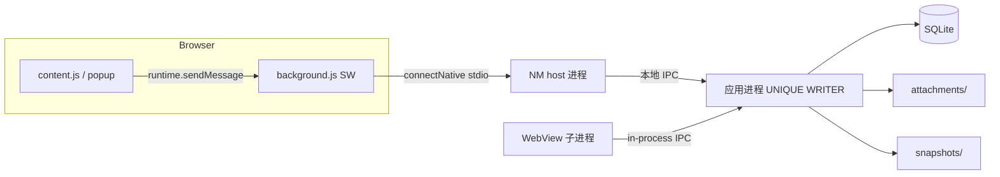

# ADR：桌面主程序架构与技术选型

| 字段 | 值 |
| --- | --- |
| 标题 | ADR-001 桌面栈、进程角色、跨平台适配与通信原则 |
| 作者 | D01 design PR |
| 日期 | 2026-09-06 |
| 状态 | 可修订开工基线（PR 合并后生效） |
| 上级 | [README.md](README.md) · [D01 #17](https://github.com/awordx/JIANXING-Resume-Autofill/issues/17) |
| 并列 | [product-requirements.md](product-requirements.md) · [data-privacy.md](data-privacy.md) · [downstream-decisions.md](downstream-decisions.md) |

本 ADR 建议 **用什么技术、哪些进程角色、怎么说话、平台边界在哪**。完整 JSON Schema 归 [D05 #23](https://github.com/awordx/JIANXING-Resume-Autofill/issues/23)；host 实现归 [D06 #24](https://github.com/awordx/JIANXING-Resume-Autofill/issues/24)；安装注册归 [D13 #29](https://github.com/awordx/JIANXING-Resume-Autofill/issues/29)。D01 不脚手架 `/desktop` 源码。

平台无关契约使用 **进程角色名**，不写 `*.exe`。

---

## 1. Overview

在现有 Chrome/Edge 插件之外增加 **本机桌面主程序**：唯一写入者持有 SQLite 与附件目录；浏览器经 **Native Messaging** 连接 **NM host 进程**；GUI 用 WebView（Tauri 2 下 Windows 为 WebView2，macOS 为 WKWebView）。

**Windows 与 macOS 都是目标平台。** 实现可 Windows 优先，但 D02 起必须有 macOS 构建与 NM 原型，不能等 Windows 全做完再移植。业务模型、SQLite、事件、AI 建议、通信消息保持平台无关。Linux 仍非首版产品。浏览器首阶段仍是 Chrome/Edge，**不默认承诺 Safari**。

插件继续用 JavaScript，根目录布局与当前 ZIP 打包不变。

---

## 2. Background & Motivation

当前插件是 MV3 service worker + offscreen AI host，无 `nativeMessaging` 权限，无扩展 `key`（见 [README 现状](README.md#现状以仓库代码为准不以-readme-宣传为准)）。`chrome.storage.local` 适合模板，不适合带附件的申请时间线和可验证备份。

Chrome 官方协议（[Native messaging](https://developer.chrome.com/docs/extensions/develop/concepts/native-messaging)）：

- 每条消息：原生字节序的 32 位长度 + UTF-8 JSON。
- Host → 浏览器上限 **1 MB**；浏览器 → host 上限 **64 MiB**。
- `allowed_origins` **禁止通配符**。
- 扩展必须声明 `nativeMessaging`；`connectNative` / `sendNativeMessage` **不能在 content script 调用**，只能在扩展页或 service worker。
- `sendNativeMessage` **每条消息拉起一个新 host 进程**；`connectNative` 保持进程直到 port 销毁。
- **Windows：** `HKCU\Software\Google\Chrome\NativeMessagingHosts\<name>` 指向 manifest；stdout 必须 `O_BINARY`；另有 `--parent-window=`（SW 下为 0）。
- **macOS / Linux：** manifest 在固定目录。用户级 Chrome 默认为 `~/Library/Application Support/Google/Chrome/NativeMessagingHosts/<name>.json`；系统级 `/Library/Google/Chrome/NativeMessagingHosts/`。macOS/Linux 上 `path` **必须是绝对路径**。

Edge（[Native messaging](https://learn.microsoft.com/en-us/microsoft-edge/extensions/developer-guide/native-messaging)）同构。Windows 上写 `HKCU\SOFTWARE\Microsoft\Edge\NativeMessagingHosts\`。Edge 官方查找顺序会回退到 Chromium/Chrome 键——**禁止依赖该回退当配对通道**（见原 D01 结论，仍然成立）。macOS 用户级 Edge 目录为 `~/Library/Application Support/Microsoft Edge/NativeMessagingHosts/`（**待验证**频道变体，D13 对照 [Edge 文档](https://learn.microsoft.com/en-us/microsoft-edge/extensions/developer-guide/native-messaging) 实测）。

Chrome/Edge 传给 host 的 **第一个参数是调用方 origin**（`chrome-extension://<id>/`）。`argv[0]` 是可执行路径，**不得**拿去比对 origin。实现扫描 argv 找 origin token。

这些事实迫使：host 必须 stdout 纯净、按 origin 校验、业务 JSON 远小于 1 MB；Windows 双写 Chrome+Edge 注册；macOS 分别写 Chrome 与 Edge 的用户级 `NativeMessagingHosts`。

---

## 3. Decision

### 3.1 桌面栈：推荐 Tauri 2（Electron 是可行备选，不是禁区）

**推荐 Tauri 2 + Rust 后端**，依据是 **本项目的团队成本、打包体积、原生集成与跨平台维护**，不是「Electron 必须管理员 / 天然不安全 / 不能做 stdio」。

| 本项目需要 | Tauri 2 | Electron |
| --- | --- | --- |
| 唯一写入者 + SQLite + 附件路径 | Rust 与文件系统在同一应用进程；可用 `rusqlite`/`sqlx` | 同样能做。常见是 `better-sqlite3` 等 native 模块，随 Electron ABI 重建（维护成本） |
| Native Messaging stdio | 可用独立 helper，或 **同一产品二进制** 加 `--native-host` 进入无 GUI、二进制 stdout 模式 | **Node 可以**正确写 4 字节长度前缀（多款产品已这样做）。stdout 纪律是工程问题，不是运行时做不到 |
| 安装体积 | 依赖系统 WebView2 / WKWebView，安装包通常明显小于内嵌 Chromium。**具体 MB 数待本仓库打样后填写，此处不写死** | 内嵌 Chromium，安装包通常更大。electron-builder 默认 NSIS **可以** `perMachine: false` 做 per-user、无管理员（[electron-builder NSIS](https://www.electron.build/nsis)） |
| Windows + macOS | 同一套 Rust 后端；Windows WebView2、macOS WKWebView | 同一套 Chromium，两端行为更接近，体积与更新面也两端都大 |
| 系统通知 / Keychain / 托盘 | 走原生 crate / 插件，适配面要自己测 | 生态示例多（含 NM）。渲染进程若打开 `nodeIntegration` 会放大 fs 暴露面——这是 **配置错误**，不是 Electron 必然不安全 |
| 团队 | 新桌面代码；插件已是 JS。Rust 学习成本换共享 crate 与较小运行时 | 招聘前端更熟；等于再养一套 Chromium |

**独立 host 二进制不是唯一实现。** 可选：(A) 单独 helper 可执行文件（推荐，stdout 与 GUI 隔离更干净）；(B) 同一产品二进制以 CLI 标志进入 host 模式。两种都要保证 GUI 日志永不写到 host 的 stdout。D02/D06 原型二选一，失败则换另一种，**不**因此改业务协议。

**不选 Electron 的主要代价：** 两端都带 Chromium、更新与安全补丁面更大、SQLite native 模块要跟版本；本项目还要自己做 Keychain/DPAPI/NM 注册，Electron 并不能少掉这些适配。

**选 Electron 的主要代价（若负责人改选）：** ADR 本节与 D02 脚手架作废，协议与产品模型仍可用。

Sidecar（[Embedding External Binaries](https://v2.tauri.app/develop/sidecar/)）可把 host helper 放进安装布局；host 必须仍能被浏览器按 manifest `path` 直接拉起。

### 3.2 安装形态

| 平台 | 建议交付 | 说明 |
| --- | --- | --- |
| Windows | NSIS per-user 安装包（`setup.exe` 是 **Windows 交付物文件名**，不是协议概念） | Tauri NSIS **默认 current user**，装到 `%LOCALAPPDATA%`（[Windows Installer](https://v2.tauri.app/distribute/windows-installer/)）。MVP 不默认 MSI；`installMode=both` 会要管理员，不采用 |
| macOS | `.app` + `.dmg`（[macOS Application Bundle](https://v2.tauri.app/distribute/macos-application-bundle/)、[DMG](https://v2.tauri.app/distribute/)） | 默认最低系统 Tauri 写的是 **10.13**；本项目建议 **macOS 11+**。Apple Silicon 一等；Intel 用 `universal-apple-darwin` 或单独 x86_64，**待验证**。签名与公证见 §8 |

未持有签名材料前 **不宣传已签名 / 已公证**。Windows 写 SmartScreen；macOS 写 Gatekeeper。

卸载：删除程序文件、快捷方式/应用包、本应用的 NM 注册；**默认保留**用户档案目录。删数据必须单独确认（D13）。

### 3.3 仓库布局（同仓，插件留在根目录）

```text
/                          现有插件（D01 零改动）
/docs/desktop-mvp          本设计
/docs/ai-repeat-validation.md   保持不动
/desktop                   未来桌面应用（D02+）
/desktop/crates/data-service   库 crate，链进应用进程；不是第三个常驻写入进程
/desktop/crates/native-host    host 角色（独立 helper 或同一二进制的 host 模式）
/desktop/crates/protocol       （D05，库 crate）
```

插件与桌面 **版本号不必相等**；共享 `protocolVersion`。产品名建议 **Resume Pro Desktop**。NM host 名建议 `com.resumepro.desktop`（Chrome `name` 规则）。

当前插件 [`LICENSE`](../../LICENSE) 为 MIT。桌面模块许可 **未定案**。

### 3.4 进程角色（平台无关契约）

不要在协议或数据层写「两个 EXE」。角色如下：

| 角色 | 职责 | 实例数 |
| --- | --- | --- |
| **应用进程（unique writer）** | 产品主二进制。持有 SQLite、附件、快照、幂等表、备份、current 指针、系统通知登记。Tauri 后端链 `data-service` 库 | **恰好一个**（单实例） |
| **NM host 进程** | 解码 NM 帧、校验 origin/大小、按需启动或连接应用进程、白名单 RPC、**持久化提交后再回包**。不打开 SQLite | 浏览器可拉起 **多个**（`sendNativeMessage` 每条一个；Chrome 与 Edge 各一） |
| **WebView / WKWebView 子进程** | 只渲染 UI，经应用内 IPC 调后端 | 由 WebView 自己管；**不是**写入者 |

Windows 上这两个角色常常对应两个 `.exe` 文件；macOS 上常是 `.app/Contents/MacOS/` 里的主二进制 + helper。那是打包细节。



规则：

1. 唯一写入者 = 应用进程。v1 **不允许**第三个常驻 writer。
2. Host 发现应用进程未运行时可 **按需启动** 它（可无可见窗口），再连本地 IPC。所有 host 实例连这一个应用进程。
3. **单实例：** 平台适配（Windows 命名 mutex + named pipe；macOS 建议 unix domain socket + 锁文件，或 Tauri 单实例插件）。第二次启动 UI：激活已有窗口。第二 host：只连接。
4. **关主窗口 ≠ 退出。** 托盘（Windows）/ 菜单栏（macOS）提供「打开」「退出」。
5. **空闲退出进程可以**，但 **不是提醒的可靠性基础**（§3.8）。
6. **禁止**未鉴权 localhost HTTP。配对不走 HTTP（§3.7）。
7. 本地 IPC 只允许当前用户（Windows pipe DACL = 当前 SID；macOS socket `0600` 且放在用户 Application Support 下）。不因为「本机」就信任。

本地 IPC 选型 **待验证**（V1）：Windows named pipe 是现成的；macOS 用 unix socket。不要在 D01 把 named pipe 写进平台无关信封。

### 3.5 为何 host 的 stdout 必须纯净

Chrome 把 host 的 **stdout 整段当作协议帧**。GUI 框架日志会破坏 4 字节前缀。因此 host 模式：CRT/进程设二进制 stdout；只写长度前缀 JSON；日志走文件/stderr。这与「必须两个文件」不是同一句话。

### 3.6 插件侧连接落点（D07 实现，D01 约束）

当前 [`background.js`](../../background.js) 的 `onClicked` 打开独立的 `popup.html` 管理标签页，同时处理 `OPEN_MANAGER`、`ENSURE_AI_HOST` 和 Native Messaging worker。管理页不再通过网页 iframe 暴露。

D07 将：在 **service worker** 调用 `connectNative`（推荐）或受控的 `sendNativeMessage`；增加 `nativeMessaging` 权限（**D07 版本号提升，不是 0.3.0**）；`desktopSaveIntents` / `desktopOutbox` / `desktopClientInstanceId` / `desktopPairing`；侧边栏保存岗位与确认投递。快照字节走扩展源 IndexedDB（见产品 §8.5）。

MV3 SW 与 `connectNative` 生命周期 **待验证**（V4）。

### 3.7 非 NM 配对引导（冻结）

Chrome **不会启动** host，除非 origin 已在 `allowed_origins`。插件不能把 `chrome.runtime.id` 经 NM 送给尚未认识它的 host。

**冻结：** 桌面 UI 粘贴扩展 ID（Chrome / Edge 分开）→ 写入对应该浏览器的 host manifest → 提示重载扩展。第一条 NM 是 `handshake`，不是配对。

- Windows：HKCU Chrome 与 Edge 键都写（不靠 Edge→Chrome fallback）。
- macOS：写入用户级 `NativeMessagingHosts` 目录（Chrome 官方路径见 §2；Edge 路径 D13 实测）。不写系统级 `/Library/...`（要管理员）。

**已安装但未配对** ≠ 未安装：不建 SaveIntent。移动 ZIP 导致 ID 变化 = 重新粘贴。

### 3.8 提醒与后台（平台实现）

共同语义见 [产品需求 §5.4](product-requirements.md#54-提醒与进程生命周期共同语义)。

| | Windows | macOS |
| --- | --- | --- |
| 关窗 | 隐藏到托盘（若启用） | 隐藏到菜单栏 extra / Dock 仍在（习惯不同，D02 选一种并写进设置） |
| 后台提醒 | 用户授权后，用 **计划应用通知** `ScheduledToastNotification` / AppNotification 日程 API（[Schedule an app notification](https://learn.microsoft.com/en-us/windows/apps/develop/notifications/app-notifications/app-notifications-scheduled)）。官方：计划通知有约 **5 分钟投递窗口**，关机过久可能丢 | `UNUserNotificationCenter` + `UNCalendarNotificationTrigger`（需通知权限）。不要求 Login Item |
| 未打包 Win32 | 需要一个带 AUMID 的开始菜单快捷方式（由安装器创建，D13 / #29）。**已验证**，见 §3.8.1 | — |
| 主动退出 | 默认移除未触发的计划 Toast，并告知 | 默认移除 pending UNNotification，并告知 |
| 开机启动 | **不**注册 Run 键 / 计划任务保活 | **不**偷偷加 Login Item |
| 进程空闲退出 | 允许；与提醒解耦 | 允许；与提醒解耦 |

D10 验收：启用后台提醒并授权后，**杀掉应用进程**，到期仍应尽量弹出系统通知（受 OS 窗口限制）。未授权时待办列表与逾期汇总仍可用。

#### 3.8.1 Windows 计划 Toast 实测（2026-09-13，Windows 11 26200）

原来标着「待验证（V9）」的那条已经在本机跑过，四个结论：

1. **`CreateToastNotifierWithId` 对没注册过的 AUMID 直接抛「无效的 applicationId」。** 所以能力检查就是这一次调用本身，不需要去猜快捷方式文件在不在。这也确认了 AUMID 注册是安装器的责任（D13 / [#29](https://github.com/awordx/JIANXING-Resume-Autofill/issues/29)），不是运行期能补的。
2. **计划脱离登记它的进程。** 用一个已注册的 AUMID 登记 70 秒后的通知，登记进程退出；另一个新进程仍能从 `GetScheduledToastNotifications()` 里列出这条计划。这正是本节要求验证的那一条。
3. **到点由系统投递。** 到期后该计划从列表里消失，通知出现在通知中心。
4. **勿扰 / 专注助手会压掉横幅，但通知照样进通知中心。** 所以「没弹出来」不等于「没送到」——界面措辞不许把两者混为一谈，也不许因此说提醒失败。

实测用的是一个第三方已打包应用的 AUMID，目的是把「WinRT 这条路通不通」与「我们自己的 AUMID 注册好没有」分开。用我们自己的 AUMID 做端到端走查要等 D13 的安装器。

### 3.9 跨平台适配边界（D02 起就要列测试）

| 边界 | Windows | macOS |
| --- | --- | --- |
| 用户数据目录 | `FOLDERID_LocalAppData` → `%LOCALAPPDATA%\ResumePro\` | `NSApplicationSupportDirectory` → `~/Library/Application Support/ResumePro/` |
| 应用缓存 | LocalAppData 下 `cache\` 或 WebView2 用户数据文件夹 | `NSCachesDirectory` → `~/Library/Caches/ResumePro/` |
| 本地 IPC / 单实例 | named pipe + mutex | unix socket + 锁文件（或等价）。**待验证** |
| 按需启动应用进程 | host 启动产品 `.exe`，无控制台窗口 | host 启动 `.app` bundle 内二进制；路径含空格。**待验证** Gatekeeper 对 helper 的影响 |
| NM 注册 | HKCU Chrome + Edge | 用户级 NativeMessagingHosts 目录，Chrome + Edge |
| 凭据 | Credential Manager / DPAPI | Keychain |
| 通知 / 托盘 | Toast + 托盘图标 | UNUserNotification + 菜单栏 |
| 安装升级卸载 | NSIS per-user；卸载留档案 | dmg 拖入 / 删 .app；卸载留 Application Support 档案 |
| 签名 | Authenticode；无证书则 SmartScreen | Developer ID + 公证 |

---

## 4. 协议原则（不是 D05 Schema）

D05 必须包含的信封字段（此处冻结名字与枚举，不写 JSON Schema）：

**请求公共字段：** `protocolVersion`、`messageId`、`clientInstanceId`、`messageType`、`occurredAt`、`payload`。

**档案身份字段：** `archiveId`、`restoreEpoch`。含义是调用方声称正在访问的 **当前档案身份**，桌面必须与自己的 current 指针比对。**禁止**用桌面当前身份替旧消息补上这两个字段。

| `messageType` | `archiveId` / `restoreEpoch` |
| --- | --- |
| `health` | **禁止携带**（尚未、也不需要档案身份）。若携带 → `identity_not_allowed` |
| `handshake` | **禁止携带**。身份只出现在应答。若携带 → `identity_not_allowed` |
| `application.queryCandidates` | **必须携带**，且等于握手得到的当前身份 |
| `job.save` / `fill.submit` / `snapshot.chunk` / `submit.confirm` | **必须携带**当前身份。另在 payload/outbox 保存不可变的 `sourceRestoreEpoch`（绑定时的来源 epoch） |
| `outbox.reconcile` | **外层必须携带当前身份**；payload 每项才带旧 `sourceRestoreEpoch`。外层缺失或与 current 不符 → 整批拒绝，不得用 current 回填 |

缺失必须字段 → `identity_missing`（`retryable=false` 直至客户端补上）。
与 current 不符 → `restore_epoch_mismatch`（`retryable=false` 作为写入；不是成功重放）。
协议区间不交 → `protocol_incompatible`。
三种情况都 **不得**把请求改写成当前身份后再执行。

握手后写入示例（字段名冻结）：

```json
{
  "protocolVersion": 1,
  "messageId": "0193a0c2-7c1a-7d2e-b8c1-0f1e2d3c4b5a",
  "clientInstanceId": "ext-instance-uuid",
  "messageType": "job.save",
  "occurredAt": "2026-09-06T12:00:00.000Z",
  "archiveId": "archive-uuid",
  "restoreEpoch": "epoch-current-uuid",
  "payload": { "sourceRestoreEpoch": "epoch-current-uuid" }
}
```

**应答：** `{ protocolVersion, correlationId, resultId?, ok, error?: { code, retryable, message? }, payload }`。

- `correlationId` = 请求 `messageId`（`snapshot.chunk` 则为 **该块** 的 `messageId`，见下）。
- `ok: true` 的写入应答必须有 `resultId`。
- `ok: false` **没有** `resultId`。仅当 **当前身份校验已通过** 且完整消息身份/摘要命中已提交回执时，普通重放才返回 `ok: true` 和原 `resultId`。
- SaveIntent **不是** NM `messageType`。

**MVP `messageType` 枚举：**

| `messageType` | 方向 | 说明 |
| --- | --- | --- |
| `health` | 双向 | 探活；无档案身份 |
| `handshake` | 双向 | 返回协议区间、app 版本、当前 `archiveId`、`restoreEpoch`、`capabilities`。**不是配对** |
| `application.queryCandidates` | 插件→桌面 | 两层候选；必须带当前身份 |
| `job.save` | 插件→桌面 | 已绑定后的岗位保存 |
| `fill.submit` | 插件→桌面 | 填写事件元数据 + 可选 `snapshotId`/`sha256`（**不含**快照字节） |
| `snapshot.chunk` | 插件→桌面 | **每块独立 `messageId`**；完整 UTF-8 JSON 信封 ≤ 64 KiB；发送前字节已在扩展源 IDB |
| `submit.confirm` | 插件→桌面 | 用户明确确认已投递（D07） |
| `outbox.reconcile` | 插件→桌面 | 当前身份在外层；payload 为有界旧身份/摘要列表；只读历史回执，见产品 §8.11 |

原则：

1. **握手成功**即返回当前 `(archiveId, restoreEpoch)`。仅协议不兼容或 kill switch 时握手失败。epoch 变化 **不是**握手失败。
2. **普通写入两段校验：** (a) 请求信封的 `(archiveId, restoreEpoch)` **必须等于**桌面 current；(b) 仅在 (a) 通过后，才按 `(clientInstanceId, messageId, sourceRestoreEpoch)` + `payloadSha256` 判定重放。「相同载荷返回原 resultId」**只适用于 (a) 已通过、且 sourceRestoreEpoch 也等于 current** 的普通写入。`sourceRestoreEpoch` ≠ current → `restore_epoch_mismatch`，**不得**当重放成功。旧 epoch 消息只能走 `outbox.reconcile` 只读对账。详见 [产品 §8.10–§8.11](product-requirements.md#810-插件队列saveintent-与-bound-outbox)。
3. **64 KiB 是完整序列化业务信封的 UTF-8 字节上限**（不含 NM 的 4 字节长度前缀）。D05 建议 raw chunk ≤ 32 KiB；超限拒绝。
4. **`snapshot.chunk` 块级身份：** 每个 chunk 有持久化的独立 `messageId`，不得与 `fill.submit`/`job.save` 或其它块共用。业务幂等键另含 `(clientInstanceId, snapshotId, chunkIndex, sourceRestoreEpoch)`。重启不得新铸块身份。`chunkCursor` = 已连续 ACK 的下一块下标；较后块的 ACK **不得**跳过中间未确认块。分片 ACK ≠ 完整快照 ACK。见产品 §8.5。
5. **`allowed_origins` 无通配符。** D01 不加 `key`。
6. 开发机注册脚本只用于隔离测试（D06）；生产注册归 D13。
7. 恢复：新目录、保留 backup `archiveId`、**新铸 restoreEpoch**。握手成功；插件暂停 `sourceRestoreEpoch` ≠ current 的绑定队列。意图重新走候选。

Host 校验顺序：扫描 argv 的 origin token ∈ 当前 manifest；单帧 ∈ (0, 64 KiB]；JSON 可解析；`messageType` ∈ 上表；按上表检查身份字段；写成功才回帧。

---

## 5. 数据服务职责边界

| 角色 | 允许 | 禁止 |
| --- | --- | --- |
| NM host 进程 | NM 编解码、origin/大小、按需启动应用进程、转发白名单 | 打开 SQLite、写附件、弹业务 GUI、stdout 日志 |
| 应用进程 | SQLite、附件、快照、幂等表、备份、current 指针、系统通知登记、配对写 manifest | 第三个 writer、监听 127.0.0.1 给网页、执行模型返回的命令 |
| WebView 子进程 | 经应用内 IPC 调后端 | 直接写 `archive.db` |
| 插件 SW | 意图队列、绑定 outbox、握手、白名单 RPC、扩展源 IndexedDB 快照暂存 | 把 `aiConfig.apiKey` 放进 NM；从未配对就持久化意图 |

SQLite 是嵌入式库（[sqlite.org](https://sqlite.org/)），单用户本地档案，文件格式跨平台。WAL + 唯一写入者。附件不进 blob 表。

---

## 6. API / Interface Changes（相对今天的插件）

D01 **不改**插件。下游预期：

| 时机 | 变化 |
| --- | --- |
| 现在 0.3.0 | 无 NM |
| D07 | 追加 `nativeMessaging`；意图/绑定队列；粘贴 ID 配对；确认投递 |
| D08 | 扩展源 IndexedDB 快照暂存；可能申请 `unlimitedStorage` |
| 永不（v1） | 桌面档案镜像进 `chrome.storage`；插件 Key 复制进备份；content script 直连 native；用第一条 NM 做配对；content script 把快照写进 **页面** IndexedDB |

---

## 7. Alternatives Considered

### 7.1 Electron

可行。见 §3.1。本项目仍推荐 Tauri，因为体积、WebView 复用和 Rust 后端与 host/SQLite 共享，而不是因为 Electron「不能做 NM」或「必须管理员」。

### 7.2 纯插件存储当档案

无可靠大附件、无独立于浏览器的备份目录。Epic 要求桌面权威源。**不选。**

### 7.3 桌面开 localhost HTTP 给插件

D05 禁止。**不选。**

### 7.4 GUI 与 host 抢同一 stdout

不选「未分流的同一 stdout」。可选独立 helper **或** 同一二进制的 host 模式，见 §3.1。

### 7.5 Windows MSI 作为默认 / macOS App Store 作为默认

企业 MSI、Mac App Store 沙箱（对写入 Chrome NativeMessagingHosts 不友好，社区讨论常见）都不作为首版默认。**待负责人**是否补 MSI；App Store **非目标**。

---

## 8. 最低运行时

- 插件已要求 Chrome/Edge **116+**（Windows 与 macOS 相同）。
- WebView2：Win10 22H2 / Win11（[WebView2](https://learn.microsoft.com/en-us/microsoft-edge/webview2/)）。安装器应能引导缺失 Runtime。
- WKWebView：随 macOS。
- 产品建议：**Windows 10 22H2+ x64**；**macOS 11+ Apple Silicon**。Windows ARM64、macOS Intel universal **待验证**。
- 用户数据：Windows `SHGetKnownFolderPath(FOLDERID_LocalAppData)`；macOS Application Support。**禁止**硬编码开发机路径。

---

## 9. Security & Privacy（架构切面）

细节见 [data-privacy.md](data-privacy.md)。

- NM origin 白名单；64 KiB；无通配；无 HTTP 配对。
- IPC 仅当前用户。
- 不把插件 `aiConfig` 发到桌面。桌面 Key：Windows DPAPI / Credential Manager；macOS Keychain（D11）。
- 威胁：恶意扩展进入 `allowed_origins` 可写档案 → 禁止通配。

---

## 10. Observability

日志：错误码 + 脱敏上下文。禁止简历/邮件正文、API Key。

诊断包：日志 + 版本 + `archiveId`/`restoreEpoch`/`schemaVersion` + 意图/绑定队列计数；不含附件与快照正文。

冷启动目标（D06 验证）：host 已在、应用进程已在时握手 **< 200 ms**；按需拉起 **< 2 s**（**待验证**，macOS 可能更慢）。

---

## 11. Rollout Plan

| 阶段 | 内容 |
| --- | --- |
| P0 | 本 ADR 经负责人确认（含平台与正式版范围） |
| P1 | D02 壳（**含 macOS 原型**）+ 单实例 + 数据目录；D03 数据层；D04 手动 UI |
| P2 | D05 契约 → D06 host（Win + Mac 注册路径）→ D07 |
| P3 | D08 IndexedDB 暂存 + 分片；D09 |
| P4 | D10 系统调度提醒；D11 |
| P5 | D12；D13 Win NSIS + Mac dmg；D14 两端安装验收（覆盖范围随正式版决议） |

回滚：卸载桌面保留档案；插件去掉 NM 后仍能填表。

---

## 12. 风险

| 严重度 | 风险 | 缓解 |
| --- | --- | --- |
| 高 | GUI stdout 污染 NM | host 模式二进制 stdout；契约测试 |
| 高 | 多写入者损坏 SQLite | 单实例应用进程 |
| 高 | 把 idle 退出当成次日提醒 | 系统调度；文案；D10 杀进程测试 |
| 中 | 未打包 ID / 未配对当未安装 | 粘贴 ID；未配对不建意图 |
| 中 | 重复恢复碰撞 generation | restoreEpoch UUID |
| 中 | macOS NM 路径 / 公证 / 按需启动 | D02/D06/D13 原型（V10–V12） |
| 中 | Win 计划 Toast 5 分钟窗口 | 文案 + 打开应用汇总 |
| 低 | Rust 人力 | crate 边界小；备选 Electron 已记录真实代价 |

---

## 13. Open Questions

见 [downstream-decisions.md](downstream-decisions.md#4-需要项目负责人选择)。

---

## 14. References

- Chrome Native messaging: https://developer.chrome.com/docs/extensions/develop/concepts/native-messaging
- Edge Native messaging: https://learn.microsoft.com/en-us/microsoft-edge/extensions/developer-guide/native-messaging
- Chrome 扩展 storage / IndexedDB: https://developer.chrome.com/docs/extensions/develop/concepts/storage-and-cookies
- Tauri 2 Windows installer: https://v2.tauri.app/distribute/windows-installer/
- Tauri 2 macOS bundle: https://v2.tauri.app/distribute/macos-application-bundle/
- Tauri 2 macOS signing/notarization: https://v2.tauri.app/distribute/sign/macos/
- Tauri 2 sidecar: https://v2.tauri.app/develop/sidecar/
- electron-builder NSIS `perMachine` 默认 false: https://www.electron.build/nsis
- Windows 计划应用通知: https://learn.microsoft.com/en-us/windows/apps/develop/notifications/app-notifications/app-notifications-scheduled
- KNOWNFOLDERID LocalAppData: https://learn.microsoft.com/en-us/windows/win32/shell/knownfolderid
- WebView2: https://learn.microsoft.com/en-us/microsoft-edge/webview2/
- SQLite: https://sqlite.org/
- Epic #15、D02 #16、D05 #23、D06 #24、D13 #29
