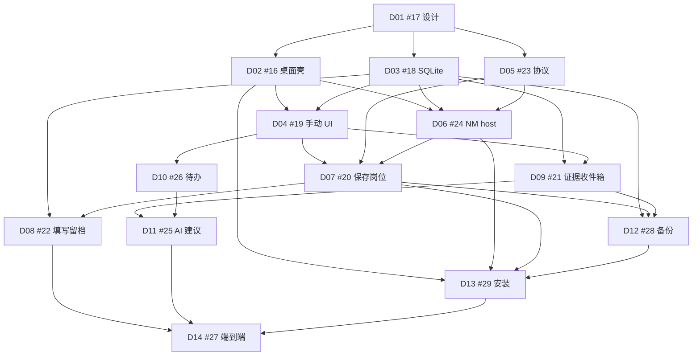

# 下游任务映射与决策清单

| 字段 | 值 |
| --- | --- |
| 标题 | D02–D14 如何消费 D01；定案 / 待选 / 待验证 |
| 作者 | D01 design PR |
| 日期 | 2026-09-06 |
| 状态 | 可修订开工基线（PR 合并后生效） |
| 上级 | [README.md](README.md) · [D01 #17](https://github.com/awordx/JIANXING-Resume-Autofill/issues/17) · [Epic #15](https://github.com/awordx/JIANXING-Resume-Autofill/issues/15) |
| 并列 | [product-requirements.md](product-requirements.md) · [adr-architecture.md](adr-architecture.md) · [data-privacy.md](data-privacy.md) |

本文 **不改变** Epic 硬依赖图。跨平台工作仍按相同职责拆分（D02 壳、D06 host、D13 安装），不另开「Mac 专项」阻塞边。若未来要拆 issue，只在 PR 里建议，不直接建 `blocked-by`。

D01 的实现就是文档 PR；D02+ 是后续 issue/PR。确认前不得宣称架构已冻结。

---

## 1. 硬依赖图（保持原样）

来自 Epic #15 与规划 `map.json`：

**阶段出口**（Epic 标签）：

| 阶段 | 出口 |
| --- | --- |
| P0 | D01 决策确认 |
| P1 | D02–D04：离线手动管理申请（D02 含 macOS 原型） |
| P2 | D05–D07：插件能保存岗位并补传（含意图队列与 `submit.confirm`） |
| P3 | D08+D09：快照（含 IndexedDB 暂存）与回复证据 |
| P4 | D10+D11：系统调度待办与 AI 建议 |
| P5 | D12–D14：备份/安装/端到端（Win + Mac 覆盖范围随正式版决议） |

**执行波次**不变：第一波 D01；第二波 D02、D03、D05 可并行；第三波 D04、D06；第四波 D07，D09/D10 在 D04 后分别推进。

「可用 mock 提前开发」≠「依赖未验收就关闭 issue」。

---

## 2. D02–D14 消费映射

| 工作 | Issue | 硬依赖 | 从 D01 消费的结论 | 本 issue 仍需自己定的 |
| --- | --- | --- | --- | --- |
| D02 桌面壳、单实例、数据目录 | [#16](https://github.com/awordx/JIANXING-Resume-Autofill/issues/16) | D01 | **应用进程 = 唯一写入者**；Windows + **macOS 原型为完成条件之一**；平台目录 API；单实例；关窗 ≠ 退出；托盘/菜单栏；无开机启动；粘贴 ID 设置页骨架；不把 `*.exe` 写进协议 | 窗口细节；IPC 具体 API（pipe vs unix socket） |
| D03 SQLite 数据层 | [#18](https://github.com/awordx/JIANXING-Resume-Autofill/issues/18) | D01 | 逻辑对象跨平台；无公司+URL 唯一约束；**`eventSequence` 与阶段投影同事务**；`imported_unclassified`；当前 epoch 指针不备份，历史回执含 sourceRestoreEpoch；正式/建议 class 与 sendMode 分开；sourcePathHint 仅内存；`occurredAt` unknown 时为 null | `CREATE TABLE`、索引、迁移 |
| D04 无 AI 管理 UI | [#19](https://github.com/awordx/JIANXING-Resume-Autofill/issues/19) | D02、D03 | 阶段码含 `filling`；`none_imported` vs `imported_unclassified` 文案；`classified` 不是「人工回复」；时间线按 `eventSequence` | 布局、快捷键 |
| D05 协议契约 | [#23](https://github.com/awordx/JIANXING-Resume-Autofill/issues/23) | D01 | 信封 **含/禁** 档案身份（见 ADR §4）；握手返回当前 epoch；普通写入先校验 current 再幂等；块级 `snapshot.chunk` messageId；`outbox.reconcile` 外层当前身份；64 KiB 整帧；SaveIntent **不是** NM 类型 | JSON Schema、错误码（`identity_missing` / `identity_not_allowed` / `restore_epoch_mismatch`）、分片帧 |
| D06 NM host | [#24](https://github.com/awordx/JIANXING-Resume-Autofill/issues/24) | D02、D03、D05 | 薄 host 或同二进制 host 模式；stdout 纯净；扫描 argv origin；按需启动 **应用进程**；Win 注册表 + Mac 用户级目录 | 可执行实现、冷启动、Mac 路径实测 |
| D07 保存岗位、配对、队列 | [#20](https://github.com/awordx/JIANXING-Resume-Autofill/issues/20) | D04、D05、D06 | **SaveIntent vs Bound outbox**；`sourceRestoreEpoch` 不可变；信封带 **current** 身份；旧 epoch 只对账不重放；从未配对不建意图；禁止待同步=已保存；粘贴 ID；`submit.confirm` | 退避、侧边栏文案、10 s 去重点击 |
| D08 快照与填写留档 | [#22](https://github.com/awordx/JIANXING-Resume-Autofill/issues/22) | D03、D07 | 写前 IDB；**每块持久化 `chunkMessageId`**；`chunkCursor` 只按连续 ACK 前进；分片 ACK ≠ 完整 ACK；>2 MiB 拒绝 | 快照 JSON 格式、字段值开关 |
| D09 证据收件箱 | [#21](https://github.com/awordx/JIANXING-Resume-Autofill/issues/21) | D03、D04 | `kind` 格式；`replyClass` 业务类型；`sendMode` 发送方式；导入后未分类 → `imported_unclassified`；导入≠改阶段 | MIME、预览 |
| D10 待办与提醒 | [#26](https://github.com/awordx/JIANXING-Resume-Autofill/issues/26) | D04 | **系统调度通知**；杀进程后仍尽量弹；未授权则列表+汇总；退出取消未触发项并告知；无偷偷开机启动；Win 5 分钟窗口写进文案 | 具体 Toast/UNUserNotification 封装、夏令时 |
| D11 AI 建议 | [#25](https://github.com/awordx/JIANXING-Resume-Autofill/issues/25) | D09、D10 | 持久化 suggestedReplyClass/suggestedSendMode；确认前证据可为 `imported_unclassified`；不确定为 unknown；Keychain/DPAPI | 提示词、OCR |
| D12 备份恢复 | [#28](https://github.com/awordx/JIANXING-Resume-Autofill/issues/28) | D03、D07、D09 | 不加密；新目录；保留 archiveId；**新铸 restoreEpoch**；备份含 `eventSequence` 与历史回执，不含当前指针；旧 epoch 只对账 | 归档格式、原子发布 |
| D13 安装升级 | [#29](https://github.com/awordx/JIANXING-Resume-Autofill/issues/29) | D02、D06、D07、D12 | Win NSIS per-user + 双写 HKCU；Mac `.app`/`.dmg` + 用户级 NativeMessagingHosts；卸载留档案；签名/公证如实写 | NSIS hooks、公证流水线、SHA-256 |
| D14 端到端 | [#27](https://github.com/awordx/JIANXING-Resume-Autofill/issues/27) | D08、D11、D13 | 含意图队列、离线快照、块级重试、杀进程提醒、重复恢复、未分类证据文案、同时间戳事件顺序、ATS 自动面试信；Win 必测 | 验收记录模板 |

### 2.1 依赖图上的张力（不改图）

1. D08 应读 D05 分片信封；不必把 D05 加进 D08 硬依赖。
2. D12 恢复测试必须用真实握手（经 D07→D05），不能只改 DB。
3. D10 应读 ADR §3.8；提醒不再依赖「15 分钟 idle」。
4. D13 同时承担 Win + Mac 交付物，工作量变大，但 **不拆新阻塞 issue**（建议：D13 内两个小 PR）。
5. 插件确认投递仍归 D07。

未改 `blocked-by`。若负责人改选 Electron，先改 D01/D05 再动 D02/D13。

**建议但本次不创建：** 若 Mac 公证把 D13 拖死，可另开「D13b macOS 公证」平行 PR，仍挂在 #29 下，不新增 DAG 节点。

---

## 3. 本次建议定案

负责人确认前视为建议。确认后下游不得自行改成互不兼容的栈。

1. Windows **与** macOS 都是目标平台；实现 Windows 优先；**D02 完成条件包含 macOS 原型**。Linux / Safari 非首版。
2. 业务模型、SQLite、事件、建议、NM 消息平台无关。适配边界见 ADR §3.9。
3. 应用进程 = 唯一写入者；NM host = 翻译器（可多实例）；WebView 子进程不是写入者。
4. 桌面权威源；未装桌面时填写仍可用。
5. 十条产品规则（填写≠投递、回执≠通过、未导入≠未回信、UUID、AI 只建议、意图/绑定队列、不采集秘密、卸载不静默删、手动永远可用、无邮箱/云同步）。
6. Stage 折叠按 `eventSequence`；`fill_started` 不改阶段；`filling` 仅 completed/partial。
7. `replyClass` ≠ `sendMode`；已导入未分类 = `imported_unclassified`，禁止「尚未导入」。
8. SaveIntent vs Bound outbox；从未配对不建意图；禁止待同步=已保存。
9. 快照确认时生成；所有字节先持久化到扩展源 IndexedDB；重试不从新模板生成。
10. 握手后请求必须带当前 `archiveId`/`restoreEpoch`；Bound `sourceRestoreEpoch` 不可变；普通写入先校验 current；旧 epoch 只对账。
11. 提醒走用户授权的系统调度；不偷偷开机启动。
12. D01/0.3.0 不加 `nativeMessaging`、不加 `key`。
13. 插件 Key 留扩展存储；桌面 Key 进 OS 凭据库。
14. 填写留档默认元数据；业务信封 64 KiB；快照文件 ≤ 2 MiB。
15. 备份不加密；Windows NSIS per-user；macOS dmg。
16. 当前插件 MIT ≠ 未来桌面模块许可已定。

---

## 4. 需要项目负责人选择

只列真正要拍板的项。

### 4.1 首个对外「正式桌面 MVP」是否必须双平台同时交付

- **推荐：** **正式标签要求 Windows 与 macOS 都能安装、配对、保存岗位、备份恢复**（D14 两端各有一份记录）。允许 Windows 在 P1–P2 先做内部试用。 **不允许**「Windows 全部做完再移植 Mac」——D02 缺 Mac 原型即未完成。
- **理由：** 产品已明确有 Mac 用户。公证/签名会拖时间，所以实现顺序仍 Windows 优先，但正式承诺不能把 Mac 留成口头。
- **不选代价：**
  - 若选「Windows 正式 + Mac 仅预览」：Mac 用户拿到的是无公证/无 D14 的构建，支持成本高，但 Windows 求职季能先用上。
  - 若选「必须同一天双平台 GA」：公证失败会挡住 Windows 用户。

### 4.2 Tauri 2 vs Electron

- **推荐：** Tauri 2。
- **理由：** 较小运行时（系统 WebView）、Rust 后端与 host/SQLite 共享、Win+Mac 原生目录/凭据/通知适配面集中。Electron **可以** per-user 安装、**可以**做 NM stdio、**不是**天然必须管理员。见 [ADR §3.1](adr-architecture.md#31-桌面栈推荐-tauri-2electron-是可行备选不是禁区)。
- **不选代价：** 改 Electron 则 D02 脚手架与体积预期作废，产品/协议仍能用。两端都带 Chromium，更新面更大。

### 4.3 后台提醒：系统调度 vs 常驻进程

- **推荐：** 用户启用并授权后，把到期待办登记为 **系统调度通知**；应用进程仍可空闲退出。主动退出默认取消未触发项并告知。
- **理由：** 闲置 15 分钟退出无法支撑次日面试。常驻进程耗电、关机后仍没了，还容易滑向偷偷开机启动。
- **不选代价：**
  - 常驻不退出：关窗期间能提醒，但关机/重启仍要另做调度，等于两套。
  - 只做应用内待办、不弹系统通知：实现简单，用户会错过次日面试。

### 4.4 备份不加密 vs 加密

- **推荐：** MVP **不加密**，警告含 PII。
- **理由：** 加密要口令丢失策略；宣传加密却口令写旁边等于零。
- **不选代价：** D12/D14 膨胀；或不加密时用户把备份丢网盘会裸奔——用警告管理预期。

### 4.5 Windows 是否另发 MSI

- **推荐：** 仅 NSIS per-user。macOS 仍是 dmg，不受本项影响。
- **理由：** 求职者个人机；MSI/WiX 测试矩阵大。
- **不选代价：** D13/D14 双安装器。企业需求可后续加。

配对方式、64 KiB、填写留档默认仅元数据：作为建议定案，不占用拍板名额。

---

## 5. 需要后续原型验证

禁止在实现 PR 里偷偷换模型。失败后的 **统一同步顺序**（不是每项都改 D05）：

1. 修改下表「权威文档」中的条款（产品/ADR/隐私，以实际受影响者为准）；
2. 在 [#17](https://github.com/awordx/JIANXING-Resume-Autofill/issues/17) 记下决策（通过/降级/推迟）；
3. 更新「受影响 issue」的验收/范围句子；
4. 再调整实现计划或后续 PR。

不得只改 issue 而留下旧设计。保持原有依赖 DAG。

| ID | 项 | 权威文档 | 受影响 issue | 失败后的处理 |
| --- | --- | --- | --- | --- |
| V1 | Win named pipe / Mac unix socket + 单实例 | [ADR §3.4](adr-architecture.md#34-进程角色平台无关契约)、[§3.9](adr-architecture.md#39-跨平台适配边界d02-起就要列测试) | D02 #16、D06 #24 | 改用 Tauri 单实例插件或锁文件，**仍**唯一写入者。一般 **不动** D05 |
| V2 | host 按需启动应用进程 | ADR §3.4、§3.9 | D06 #24、D07 #20 | 文案「请先打开一次桌面」；禁止第三个 writer。一般不动 D05 |
| V3 | 更新 host manifest 后能否不重启就 connectNative | ADR §3.7 | D06 #24、D13 #29、D07 #20 | 配对成功后强制「重载扩展或重启浏览器」。不动 D05 信封 |
| V4 | MV3 SW 与 `connectNative` | ADR §3.6；产品 §5.2 | D07 #20 | 回落到 `sendNativeMessage` + 队列。若短连接语义变化才改 D05 样例 |
| V5 | 64 KiB 真实拒绝行为 | ADR §4 原则 3 | D05 #23、D06 #24、D08 #22 | 调错误码与 raw chunk 预算，**不**靠加大信封传附件 |
| V6 | Win10 无 WebView2 bootstrapper | ADR §3.2、§8 | D13 #29、D02 #16 | 文档改手动安装 Runtime 链接。不动 D05 |
| V7 | Windows ARM64、macOS Intel universal | ADR §8；产品 §12 | D13 #29、D14 #27 | 首发收缩为 Win x64 + Mac Apple Silicon。不动 D05 |
| V8 | 系统调度通知：杀进程/关机窗口/Mac 重启 | 产品 [§5.4](product-requirements.md#54-提醒与进程生命周期共同语义)；ADR §3.8 | D10 #26、D14 #27 | 缩小承诺为「打开应用汇总」；**不**改 D05 |
| V9 | 未打包 Win32 计划 Toast / AUMID | ADR §3.8 | D10 #26 | Compat 库或仅应用内提醒。不改 D05 |
| V10 | macOS 用户级 Edge NativeMessagingHosts 路径 | ADR §2、§3.7、§3.9 | D06 #24、D13 #29 | 以实测路径改 ADR/D13。不改 D05 |
| V11 | macOS 公证与 Gatekeeper 对 helper | ADR §3.2、§8 | D13 #29 | 预览构建写明「右键打开」。不改 D05 |
| V12 | 扩展源 IndexedDB 在 SW 重启后读回快照 | 产品 [§8.5](product-requirements.md#85-resumesnapshot)；隐私快照节 | D08 #22、D07 #20、D14 #27 | 若 IDB 不可靠：离线留档明确不可用，改产品 §8.5 与 D08/D14 验收。仅当分片帧字段变化才改 D05 |

走查 10.24 是本纪律的反例：V8 失败时去改 D05 是错误同步。

---

## 6. 本 D01 的 PR Plan

**本 issue 的唯一实现 = 文档 PR**（`docs/desktop-mvp/*`）+ 同步后的相关 issue 正文。不提交 `/desktop`、不改 `manifest.json`、不注册 NM、不碰 [`docs/ai-repeat-validation.md`](../ai-repeat-validation.md)、不改 [`LICENSE`](../../LICENSE)。

本轮负责人已授权收尾后合并；合并即完成 D01 开工基线交付，可关闭 #17 并推进 D02/D03/D05。现有推荐作为工作假设，不代表永久不可修改的规格；发布覆盖/签名/备份加密在对应交付 issue 确认。不得为预先穷尽实现细节而持续扩大 D01。

实现约束收口：D03/D07/D12 保留防止永久删除后复活的幂等墓碑；D12 保证数据库与附件在同一备份屏障内取样并校验引用；D03/D04/D11 将历史补录与更新当前进度分离。验收样例分别是“ACK 丢失→永久删除→重试不重建”“备份中删除附件不产生残包”“Offer 后补录测评不回退”。这些归实现 issue 的测试，不继续在 D01 扩写算法。

### 6.1 确认后 D02 / D03 / D05 如何开工

**D02（壳，可与 D03/D05 并行）：**

- 用 Tauri 2 建 `/desktop`（仍是后续 PR，不在 D01）。
- Windows：能启动、单实例、LocalAppData 目录、关窗≠退出、粘贴 ID 页骨架。
- **同一 PR 序列里必须出现 macOS 构建：** Application Support 目录、单实例、无窗口启动至少在开发机跑通。缺 Mac 原型不能关 D02。
- 不实现申请 UI、不注册生产 NM。

**D03（数据层，无 UI）：**

- 按字段目录建库：Application（含 `lastEventSequence`）/Event（含 `eventSequence`）/Todo/Evidence（含 sendMode）/AiSuggestion/Snapshot/AttachmentBlob/提交回执。
- `current.json` 持当前 restoreEpoch 且不备份；备份夹具保留业务历史回执的 sourceRestoreEpoch 与原 eventSequence。
- 合成测试：同岗位两条申请；同时间戳三事件折叠稳定；恢复两次同一备份 → 两个当前 epoch；旧写入拒绝、对账 not_found 不自动重写。
- 不写迁移到「已发布库」（还没有）。

**D05（契约，无生产 host）：**

- JSON Schema：health/handshake **无**档案身份；其余握手后类型 **必须**有 `archiveId`/`restoreEpoch`。
- 错误码：`identity_missing`、`identity_not_allowed`、`restore_epoch_mismatch`、`conflict`。
- 样例：`job.save` 成功/当前身份下重放/旧 epoch 拒绝；`snapshot.chunk` 每块独立 messageId、cursor 连续、完整 ACK 分离；`outbox.reconcile` 外层当前身份。
- 契约测试两端可复用。不注册 NM、不打安装包。

---

## 7. Open Questions（汇总）

仅 §4。原型项在 §5。

若负责人否决推荐：先改本文件 + 对应专文 → 评论 #17 → 再改下游 issue。禁止只在实现里偏离。

---

## 8. References

- Epic: https://github.com/awordx/JIANXING-Resume-Autofill/issues/15
- D01: https://github.com/awordx/JIANXING-Resume-Autofill/issues/17
- D02 #16 · D03 #18 · D04 #19 · D05 #23 · D06 #24 · D07 #20 · D08 #22 · D09 #21 · D10 #26 · D11 #25 · D12 #28 · D13 #29 · D14 #27
- 规划对照：`output/playwright/desktop-planning/map.json`（内部创建记录，不是用户文档）
