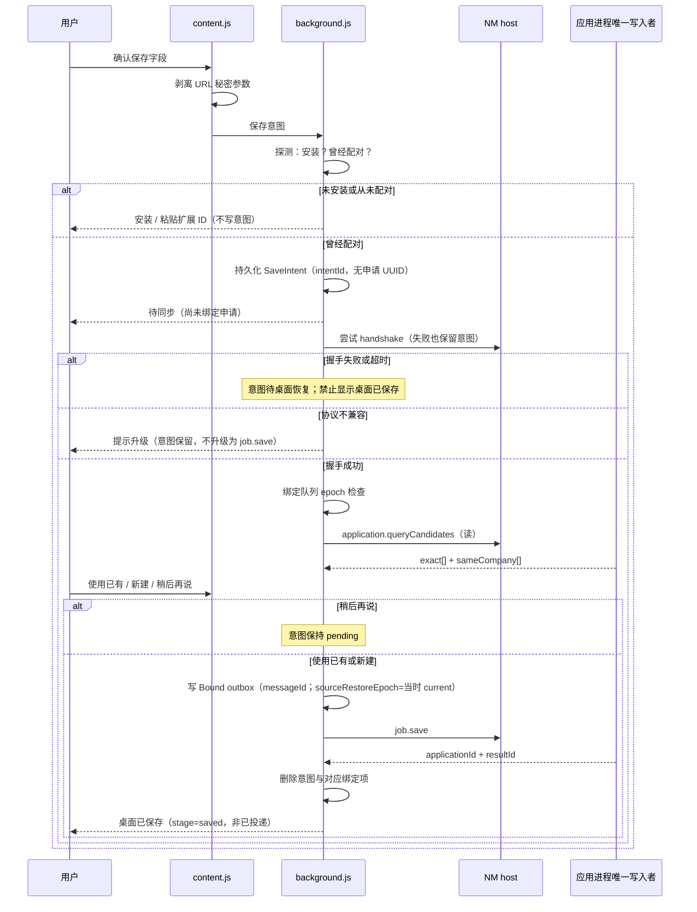
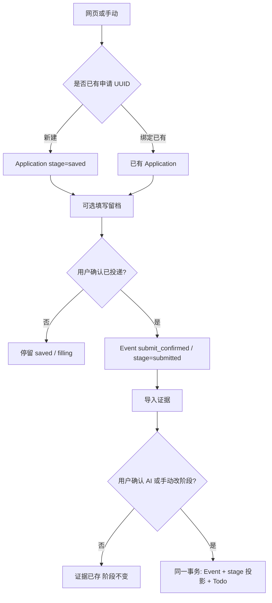
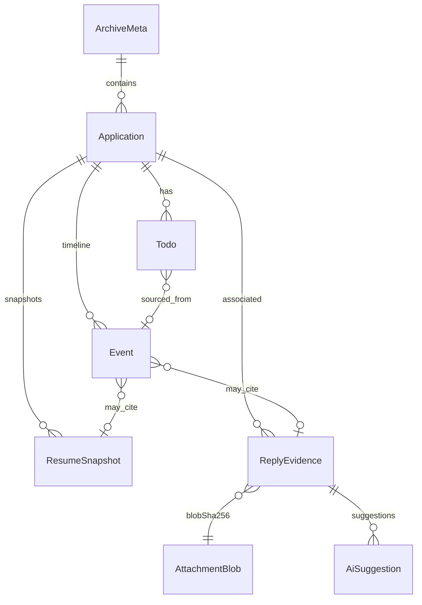

# 桌面求职管理 MVP — 产品需求

| 字段 | 值 |
| --- | --- |
| 标题 | MVP 产品需求与对象模型 |
| 作者 | D01 design PR |
| 日期 | 2026-09-06 |
| 状态 | 可修订开工基线（PR 合并后生效） |
| 上级 | [README.md](README.md) · [D01 #17](https://github.com/awordx/JIANXING-Resume-Autofill/issues/17) · [Epic #15](https://github.com/awordx/JIANXING-Resume-Autofill/issues/15) |
| 并列 | [adr-architecture.md](adr-architecture.md) · [data-privacy.md](data-privacy.md) · [downstream-decisions.md](downstream-decisions.md) |

本文定义 **做什么、不做什么、对象怎么命名**。物理表结构归 [D03 #18](https://github.com/awordx/JIANXING-Resume-Autofill/issues/18)；通信信封归 [D05 #23](https://github.com/awordx/JIANXING-Resume-Autofill/issues/23)。D01 不写 `CREATE TABLE` 或完整 JSON Schema。

---

## 1. Overview

求职者已经在用 Resume Pro 插件填写网申，但填完之后不知道「哪份投了、用了哪版简历、后来邮件是哪一岗」。本 MVP 把产品扩成 **浏览器填写入口 + 本机求职档案**：插件继续独立填表；桌面主程序保存申请、事件、附件、当次简历快照和待办。

**目标平台是 Windows 与 macOS。** 实现可以 Windows 优先，但业务模型、SQLite、事件、AI 建议和通信消息保持平台无关；D02 起必须做 macOS 原型，不能等 Windows 全做完再移植。Linux 仍非首版产品。浏览器首阶段仍是 Chrome / Edge，**不默认承诺 Safari**。

桌面档案是申请数据的权威源；插件通过受限 Native Messaging 写入。离线时持久化的是 **保存意图** 或 **已绑定业务消息**（见 §5.2），二者不是同一状态，也不得把「待同步」说成「桌面已保存」。

当前仓库 **没有** 申请对象、填写事件日志或桌面连接（见 [README 现状表](README.md#现状以仓库代码为准不以-readme-宣传为准)）。填写仍是用户点击触发；[`form-agent.js`](../../form-agent.js) 只在确认后点击安全「新增/添加」按钮，从不提交表单。本需求保持该安全边界，并加上「填写完成 ≠ 已投递」。

---

## 2. Background & Motivation

### 2.1 当前状态

- 插件 v0.3.0：多模板、AI 匹配填写、PDF/Word 解析、辅助新增条目。数据在 `chrome.storage.local`。
- AI 配置（含明文 `apiKey`）只存在扩展存储，经 offscreen worker 发往用户自己的 OpenAI 兼容接口。
- 没有「投递了没有」「面试约在哪天」「这封 HR 邮件属于哪一岗」的本地档案。
- 秋招场景下一公司多岗、同岗重复投、自动回执与面试通知混在一起，靠记忆或表格容易串记录。

### 2.2 痛点

1. 填完表不等于网站已保存或已提交，插件今天也无法知道网站是否接受。
2. 邮箱里的自动回执容易被当成「通过筛选」。
3. 没把邮件导入工具 ≠ 对方没回；UI 若写成「未回复」会误导。
4. 按公司名或 URL 去重会把两个岗位或两次投递合成一条，后续通知无法消歧。

### 2.3 目标用户

在 **Windows 或 macOS** 上使用 Chrome 或 Edge、已用 Resume Pro 填写网申的 **中文个人求职者**。不假设企业 IT、不假设多设备同步、不假设会写代码。能接受「先装桌面程序再从网页保存岗位」；不装桌面时原插件能力必须仍可用。不把 Safari 当首阶段目标。

---

## 3. Goals & Non-Goals

### 3.1 Goals（首版必须）

- 不装插件、不接 AI，也能在桌面手动走完：建档 → 确认投递 → 测评 → 多轮面试 → Offer/拒绝。
- 从网页 **主动** 保存岗位到本地；填写后可选择留档当次快照与填写事件；投递必须另一次明确确认。
- 导入 `.eml` / `.txt` / PNG / JPEG / PDF 与粘贴文本；预览；可选 AI 建议；确认后事务性更新阶段/事件/待办。
- 同公司多岗位、同岗位多次申请可区分；疑似重复只提示，不自动合并。
- 完整备份与恢复；升级/卸载默认不删档案。
- 插件原填写路径在桌面缺失、离线、AI 失败时仍可用。

### 3.2 Non-Goals（首版明确不做）

与 Epic #15 一致，D01 **不得重开**：

- 邮箱 OAuth / IMAP 轮询 / 自动拉取
- 自动提交网申、代发邮件、任意网页 Agent
- 云账号、云同步、多设备实时同步、团队协作（换电脑 = 备份恢复，不是云同步）
- Linux 成品；Safari 扩展；默认承诺 App Store / Chrome Web Store 上架
- 扩展商店上架与静默自动更新（检查更新仍可沿用插件现有 GitHub Release 提示）
- 把「首个正式版必须双平台同一天交付」写成未确认承诺（见 [开放问题](downstream-decisions.md#4-需要项目负责人选择)）
- `.msg` / Outlook 虚拟拖拽对象（不支持时提示导出 `.eml` 或粘贴正文）
- 把当前开发者机器路径写进产品
- 在 D01 修改插件权限、存储、功能或把 `manifest.json` 版本从 `0.3.0` 改掉

---

## 4. 十条冻结产品规则

来自 Epic #15，D01 只落实为可执行规则，不重新辩论。

1. **填写完成 ≠ 已投递。** `fill_completed` / `fill_partial` 不得把阶段推到 `submitted`。
2. **自动回执 ≠ 通过筛选 / ≠ 人工回复。** `auto_ack` 证据不把阶段推到 `interview`，也不暗示「已通过」。
3. **没有导入邮件 ≠ 没有收到回信。** `none_imported` 才显示「尚未导入回复证据」；已导入未分类必须「已导入，待分类」。禁止「对方未回复」。
4. **同公司多岗、重复申请必须可区分。** 禁止按公司或 URL 自动合并；身份是申请 UUID。
5. **AI 只建议。** 确认后才事务性写事件/阶段/待办；模型输出不得替换原始证据字节。
6. **桌面档案是 source of truth。** 插件离线队列分 **意图 / 已绑定消息**；幂等与 `archiveId`/`restoreEpoch` 检查。
7. **只记录用户主动使用插件的操作。** 禁止密码、OTP、API Key、Cookie；禁止全局键鼠采集。
8. **升级 / 卸载 / 恢复不得静默删除申请和附件。**
9. **AI 或网络失败时，手动管理必须仍可用。**
10. **无邮箱连接、无自动投递、无通用 web agent、无云账号、无多设备实时同步。** Linux 与 Safari 仍非首版。Windows + macOS 是架构目标，实现顺序与「正式版是否双平台同时交付」见开放问题。

---

## 5. 核心用户流程

### 5.1 纯手动（无插件、无 AI）

1. 桌面「新建申请」：公司、岗位、链接、地点、备注。默认阶段 `saved`。
2. 用户明确「确认已投递」→ 事件 `submit_confirmed`，阶段投影为 `submitted`。
3. 手动记录测评、面试（含轮次）、Offer、拒绝、撤回、结束。
4. 导入文件到证据收件箱，手动关联申请。
5. 手动待办：测评截止、面试时间、待回复。

此流程是 [D04 #19](https://github.com/awordx/JIANXING-Resume-Autofill/issues/19) 的验收闭环，不断网、不调外部 API。

### 5.2 插件辅助：保存意图 vs 已绑定业务消息

1. 用户在招聘页点「保存岗位到本地」（**D07**）。侧边栏展示提取的公司/岗位/地点/URL，缺项手补，不捏造。用户点确认后，插件记下一次 **保存意图**（见下）。
2. **仅当桌面可握手** 时，才查询两层候选（§7）；用户选「使用已有」或「新建」。默认阶段 `saved`。
3. 用户照常使用现有「一键 AI 填写」/「AI 辅助新增条目」。填写本身不依赖桌面。
4. 可选：将本次填写事件 + 简历快照归档到已绑定申请（D08；快照字节见 §8.5）。
5. 用户另点「确认已投递」（**插件按钮归 D07**，`submit.confirm`，与填写成功无关），或之后在桌面（D04）/证据确认（D11）推进阶段。

#### 5.2.1 两种队列对象（冻结）

| 对象 | 用户已经确认了什么 | 是否已有申请 UUID | 是否已盖 `archiveId`/`restoreEpoch` | UI |
| --- | --- | --- | --- | --- |
| **保存意图** `SaveIntent` | 要保存这些字段（公司/岗位/URL/地点） | **否** | **否**（可记下「上次成功握手」作提示，不作提交凭证） | 「待同步（尚未绑定申请）」 |
| **已绑定业务消息** Bound outbox | 已选「使用已有」或「新建」，协议可重试 | **是**（已有 id，或桌面将在 `job.save` 成功时返回新 id） | **是**（当前握手身份） | 「待同步」；**仅**桌面持久化应答后才「桌面已保存」 |

**禁止：** 以「先握手成功」作为「桌面不可用时才能入队」的前提。曾经配对但此刻桌面不可用时，持久化的是 **意图**，不是 `job.save`。

**禁止：** 把待同步说成已保存。

#### 5.2.2 何时确定哪些 ID

| ID | 何时确定 | 之后是否可变 |
| --- | --- | --- |
| `intentId` | 用户确认字段、产生保存意图时 | 不可变。取消则删除该意图 |
| `clientInstanceId` | 每个扩展安装 / Profile 一次 | 清存储后新 ID |
| `messageId`（绑定消息） | 用户完成「使用已有 / 新建」并派发 `job.save` / `fill.submit` / `submit.confirm` 时 | 不可变。重试沿用，不新铸 |
| 申请 UUID | 选「使用已有」= 候选 id；选「新建」= **桌面提交成功后**返回的新 UUID。意图阶段 **没有** 申请 UUID | 不可变 |
| 信封 `archiveId` / `restoreEpoch` | 每次握手后的 **当前**身份；写入与 `outbox.reconcile` 外层必须带上 | 随握手更新；不得用桌面 current 替旧消息补写 |
| Bound `sourceRestoreEpoch` | 绑定/派发写入时盖章，等于当时 current | **不可变**。与 current 不符则暂停，禁止当普通写入重放 |

#### 5.2.3 分模式行为

| 模式 | 如何判断 | 用户确认保存字段之后 | 恢复后 |
| --- | --- | --- | --- |
| **未安装 / 从未配对** | 无 host 注册，或本 origin 从未成功写入过 pairing 记录 | **不建长期意图、不建绑定队列**。说明安装或到桌面粘贴扩展 ID。填写不受影响 | — |
| **曾经配对，桌面暂不可用** | pairing 记录存在，但 host 拉起失败 / 握手超时 / 管道断开 | **持久化 SaveIntent**，UI「待同步（尚未绑定申请）」。不调用 `queryCandidates`，不铸申请 UUID，不盖 restoreEpoch | 桌面恢复 → 握手 → 若 epoch 与已有 **绑定** 队列冲突则先暂停那些绑定项 → 对每条意图：`queryCandidates` → 用户消歧 → 派发 `job.save`（此时才有 `messageId` + 身份盖章） |
| **已配对且握手成功** | 握手返回兼容协议 | 可直接 `queryCandidates`；用户选绑定后再写 Bound outbox 并发送。意图可跳过或瞬间转换 | — |
| **协议不兼容** | 握手返回区间不交 | **不把意图升级为绑定消息**，也不发送。已有意图保留并提示升级；未配对路径仍不建新意图 | 升级后再走「桌面恢复」列 |

`handshake` 与 `application.queryCandidates` 始终是 **读**，不单独构成「已保存」。

#### 5.2.4 取消、队列满、应答丢失、重复点击

- **取消字段确认：** 不写意图。
- **取消候选选择器：** 若此次从「桌面已可用」路径进来、尚未派发 `job.save`：不写绑定消息。若本就是离线意图在桌面恢复后弹出选择器：取消 = 意图保持 pending，不绑定、不丢字段。
- **用户删除某条待同步意图：** 删除意图；若已有部分上传的快照暂存，按 §8.5 清理规则。
- **队列满：** 产品上限建议 100 条意图 + 100 条绑定消息（D07 可调，须有数）。满时 **拒绝新增** 并提示处理，**不静默丢旧项**，**不阻止**原有填表。
- **应答丢失：** 绑定消息用同一 `messageId` 重试，信封带 **当前** `(archiveId, restoreEpoch)`。仅当该当前身份与桌面 current 一致、且 outbox 的 `sourceRestoreEpoch` 也等于 current 时，桌面才按 `(clientInstanceId, messageId, sourceRestoreEpoch)` + 摘要返回原 `resultId`。`sourceRestoreEpoch` 与 current 不符 → `restore_epoch_mismatch`，不能当成功重放，只能 `outbox.reconcile`。意图没有桌面幂等键，桌面恢复后只转换一次。
- **重复点击「保存岗位」：** 同一页短时间内（建议 10 s）已有 pending 意图且规范化三元组相同 → 提示已有待同步意图，不第二份；用户明确「再存一次」才新 `intentId`（对应走查 10.4 的再投）。




### 5.3 证据 + AI 建议

1. 导入 eml/txt/png/jpeg/pdf 或粘贴文本 → 本地副本 + 预览。
2. 可先不关联申请。
3. 可选调用桌面 AI：展示外发范围 → 结构化建议 → 用户确认/修改后确认/拒绝/暂存。
4. 确认时同一事务写事件、阶段投影、待办，并引用原始证据。
5. 「同时更新申请进度」由用户明确勾选；不勾时阶段事件只进时间线（`history_only`），当前阶段不动——补录旧通知时要的就是这个。候选多于一条时必须先选一条，界面和命令层都不替用户选。
6. **一条证据只认一次确认。** 确认之后**重新分析出来的那条建议也确认不了**（命令层返回 `CONFLICT`）：同一封通知确认两遍就是把事件和待办各写两遍，用户看到的是凭空多出来的重复记录。面板会在发起分析前就说明这一点，免得白花一次钱。结论要改就走已有的手工路径——改阶段、改待办、把证据重新关联到别的申请；这些入口在申请详情和收件箱里都在，不依赖 AI。



### 5.4 提醒与进程生命周期（共同语义）

五种用户/系统状态必须分开，禁止混用文案：

| 状态 | 含义 | 待办列表 | 系统通知 | 插件保存 |
| --- | --- | --- | --- | --- |
| **关闭窗口** | UI 不可见；应用进程可按平台习惯退到托盘/菜单栏或仅隐藏窗口 | 可用（再打开窗口） | 若已启用后台提醒：已登记的系统调度仍有效 | host 仍可按需拉起应用进程 |
| **后台提醒已启用** | 用户在设置中打开，并 **授予** 系统通知权限 | 可用 | 到期项写入 OS 调度；**不依赖**进程一直活着 | 正常 |
| **用户明确退出** | 托盘/菜单栏「退出」或等效 | 下次启动仍在 | **取消尚未触发的系统调度**（或按设置保留；默认取消并在退出前告知「退出后不会弹出面试提醒」） | 下次由 host 按需拉起（若仍配对） |
| **休眠 / 重启 / 关机** | OS 生命周期 | 磁盘上仍在 | 已登记的系统调度：由 OS 决定。Windows 计划 Toast 有约 5 分钟投递窗口，关机过久可能丢（**待验证于本机**，官方如此说明）。重启后应用 **不**偷偷设开机启动去补火 | 重启后需再握手 |
| **未授权通知** | 用户拒绝或从未授予系统通知 | **必须仍可用** | 不弹。设置页说明「待办在，提醒不会出现」 | 无关 |

共同规则：

1. 关窗 ≠ 退出 ≠ 关机。
2. 不把「闲置 N 分钟后退出进程」当成日程系统。进程空闲退出 **可以**存在（省资源），但次日面试必须走系统调度。
3. 不偷偷开机启动、不偷偷注册 Login Item / 计划任务「保活」。
4. 未授权通知时，应用内待办、逾期标记、打开应用后的一次汇总，仍然要做（D10）。
5. 通知正文默认不含简历/邮件正文。

平台实现差异见 [ADR §3.8](adr-architecture.md#38-提醒与后台平台实现)。

---

## 6. 阶段模型

### 6.1 稳定 stage code

Code 稳定，供存储、协议、过滤使用；展示名可本地化。MVP 中文如下。

| code | 展示名 | 含义 |
| --- | --- | --- |
| `saved` | 已收藏 | 已建档，尚未确认投递。插件保存岗位的默认值 |
| `filling` | 填写中 | MVP **会**投影。已有成功/部分填写事件且尚未 `submit_confirmed`。D04 必须能按此过滤 |
| `submitted` | 已投递 | 仅由 `submit_confirmed` 在 `saved`/`filling` 上进入；从更后阶段回来必须走 `stage_corrected` |
| `assessment` | 测评 | 笔试/在线测评等 |
| `interview` | 面试 | 任意轮次的面试；轮次不是独立 stage |
| `offer` | Offer | 录用意向/Offer |
| `rejected` | 拒绝 | 被拒（当前阶段可以是 `rejected`） |
| `withdrawn` | 撤回 | 用户主动撤回（当前阶段可以是 `withdrawn`） |
| `closed` | 结束 | **当前阶段**之一（入职、放弃收尾）。拒绝/撤回事件仍留在时间线，不与 `closed` 同时作为 current |

面试轮次是面试事件/待办上的 **整数 + 可选标签**（`round=1`，「一面」），不是新的 stage code。

### 6.2 阶段折叠函数（冻结，D03 必须实现）

`currentStage` 按该申请的 **`eventSequence` 升序** 折叠，并在写入那条事件的 **同一事务** 内更新。`recordedAt` / `occurredAt` 只表示时间，**不是**事务顺序。禁止用 UUID `id` 做并列打破。禁止普通编辑无声改阶段。纠错追加 `stage_corrected`（`from`/`to`/`actor`/`reason`），**不改写**历史事件。

`eventSequence`：每个 **已有 `applicationId` 的申请** 从 1 起单调递增的整数。分配、插入事件、更新 `currentStage` 与 `Application.lastEventSequence` 必须同一事务。未关联申请的收件箱事件使用档案级 `inboxEventSequence`（同样单调），不参与任何申请的阶段折叠。

| 情况 | 行为 |
| --- | --- |
| 幂等重试命中已提交回执 | **不**分配新序号；返回原事件/原 `resultId` |
| 同一事务写入多条事件 | 按调用方给出的批次顺序分配连续序号 |
| 事务回滚 | 序号不提交；下一笔仍从失败前的 `lastEventSequence+1` 开始（无空洞） |
| 备份恢复 | 事件带着原 `eventSequence`；**不**重编号。折叠结果与备份时一致 |
| 旧库无序号（一次性迁移） | D03 用表内稳定 `rowid` 升序赋 1..n，写入迁移记录；**不用** UUID 排序 |

`stage_corrected` 只是又一条 **set-absolute** 事件：它成为当前值是因为 `eventSequence` 更大，**不是**因为纠错永远压过未来事件。10.6 在纠错之后补 `interview_recorded` 仍然生效。走查 10.19 证明同时间戳下顺序稳定。

每个 `eventType` 的折叠效应只有四种：`set-absolute` / `never-regress` / `advance` / `no-op`。

| `eventType` | 效应 |
| --- | --- |
| `application_created` | `set-absolute saved` |
| `application_updated` | `no-op` |
| `job_saved` | `never-regress`：current ∈ {∅, `saved`} → `saved`；已是更后阶段 → `no-op` |
| `fill_started` | **`no-op`**（开始填写不改持久化阶段） |
| `fill_completed` / `fill_partial` | `advance`：仅 `saved` → `filling`；其他 current `no-op`。**绝不**→`submitted` |
| `fill_failed` / `fill_cancelled` | `no-op`（失败/取消不标「填写中」） |
| `submit_confirmed` | 仅当 current ∈ {`saved`,`filling`} 时 `set-absolute submitted`；否则 `no-op`（从 `interview` 等退回须用户 `stage_corrected`） |
| `assessment_recorded` | 仅显式推进且 current ∈ {saved,filling,submitted,assessment} 时设 assessment；历史补录或更后/终止阶段不改变 current |
| `interview_recorded` | 仅显式推进且 current ∈ {saved,filling,submitted,assessment,interview} 时设 interview；历史补录或更后/终止阶段不改变 current |
| `interview_rescheduled` | 仅当 current ∈ {`saved`,`filling`,`submitted`,`assessment`} 时设 `interview`；若 current ∈ {`interview`,`offer`,`rejected`,`withdrawn`,`closed`} 则 `no-op`（从拒绝等恢复须 `stage_corrected` 或 `interview_recorded`） |
| `offer_recorded` / `rejected` / `withdrawn` / `closed` | `set-absolute` 对应 code |
| `stage_corrected` | `set-absolute` payload.`to` |
| `evidence_*` / `note_*` / `todo_*` | `no-op` |

**历史补录约束：** 阶段相关事件的 payload 持久化 `stageUpdateMode`（`history_only` / `update_progress`）。导入通知和手动补录默认为 history_only：仍分配 eventSequence，但所有阶段效应均为 no-op。用户明确选择更新当前进度才使用 update_progress 并应用上表；历史补录不能仅因较晚记录而覆盖当前阶段，回退/从终止阶段恢复须明确的 stage_corrected（含原因）。确认通知分类不等于确认更新当前阶段。D03/D04/D11 负责实现与测试，不继续扩展 D01。

建议的正向路径（UI 可跳步，但必须写对应事件）：

```text
saved → filling → submitted → assessment → interview → offer
                                              ↘ rejected | withdrawn | closed
任意阶段 --stage_corrected--> 任意阶段（需原因）
```

### 6.3 第二维度：回复证据状态（业务类型 ≠ 发送方式）

与流程阶段独立。证据本身不蕴含阶段。

两条正交字段：

| 字段 | 含义 | 取值 |
| --- | --- | --- |
| `replyClass` | **通知业务类型** | `auto_ack` / `assessment_invite` / `interview_invite` / `action_required` / `offer` / `reject` / `other` / `unknown` |
| `sendMode` | **发送方式** | `human` / `automated` / `unknown` |

面试邀请、测评、Offer、拒信都 **可能由 ATS 自动发出**。因此：

- **禁止**仅凭 `replyClass=interview_invite`（或测评/Offer/拒信）投影成「人工回复」。
- 发送方式无法判断时 `sendMode=unknown`，**不捏造** `human`。
- 旧值 `human_reply` **不再**作为 `replyClass` 或 `replyEvidenceState`。

`replyEvidenceState` 由 **证据存在性** 与 **已确认分类** 两个维度投影，只看 **当前仍关联到该申请** 的证据（取消关联后不再计入）。未确认的 AI 建议、`kind`、`sendMode` 不进入本投影。`replyClass` 为空或 `unknown` 视为 **未分类**，不是「没有证据」。

令 `E` = 该申请当前关联证据集合；`C` = `E` 中已确认且非空、非 `unknown` 的 `replyClass` 集合。

| 条件 | `replyEvidenceState` |
| --- | --- |
| `E` 为空（从未导入，或已全部取消关联） | `none_imported` |
| `E` 非空且 `C` 为空（已导入/已关联，分类空或 unknown，或仅暂存了 AI 建议） | `imported_unclassified` |
| `C` 只有 `auto_ack` | `auto_ack` |
| `C` 含 `{assessment_invite, interview_invite, action_required, offer, reject, other}` 之一，且 **没有** `auto_ack` | `classified` |
| `C` 同时有 `auto_ack` 与上一行任一业务类 | `mixed` |

已分类的证据与仍未分类的证据并存时，按 `C` 走 `auto_ack` / `classified` / `mixed`（存在性已满足）；未分类项在详情里单独标「待分类」，**不得**因此退回 `none_imported`。

| code | 展示 | 规则 |
| --- | --- | --- |
| `none_imported` | 尚未导入回复证据 | **仅** `E` 为空。禁止写成「对方未回复」 |
| `imported_unclassified` | 已导入，待分类 | **禁止**显示「尚未导入回复证据」 |
| `auto_ack` | 已导入自动回执 | 不移动到 `interview`，不暗示通过筛选 |
| `classified` | 已导入分类通知 | 详情展示具体 `replyClass`。`sendMode` 另栏「人工 / 自动 / 未知」 |
| `mixed` | 回执与其他分类通知均有 | 列表可用摘要，详情看时间线 |

列表不得把 `classified` 写成「已导入人工回复」。走查 10.20。

---

## 7. 重复、关联与冲突

身份：**Application UUID**。D03 **不得** 对 `(company, url)` 或 `(company, title)` 建禁止重复的唯一约束。

规范化（逻辑规则，算法细节 D07/D03 实现）：

- 公司名：去首尾空白、全半角、常见后缀（有限词表，如「有限公司」）折叠后再比；原始字符串始终保留。
- 岗位名：去首尾空白、压缩空白。
- URL：去掉 fragment；剥离已知密钥查询参数（见 [data-privacy.md](data-privacy.md#71-url-脱敏与去重-url)）；host 小写。

保存时两层查询（同一最小元数据形状：id、公司、岗位、阶段、URL、更新时间；不把整库同步给插件）：

1. **精确层（走查 10.4）：** 规范化三元组 `(company, title, url)` 命中 → 「可能是同一岗位的重复投递」。默认仍由用户选使用已有 / 新建。
2. **同公司提示层（走查 10.1）：** 规范化公司相同，但 title 或 URL 不同 → 「同公司其他岗位」列表。**默认新建**，永不自动绑定。同公司命中是 **提示不是身份**。

其余规则：

3. UI 另可取消。同公司两个岗位 = 两条申请。
4. 对同一 posting 再投一次 = 用户说新建就是两条。
5. 内容哈希用于 **重复通知警告**，不因同哈希自动撤销用户选择的不同关联。
6. 误关联：改关联保留原始附件字节，追加 `association_changed`（from/to application id）。
7. 阶段折叠：见 §6.2。

---

## 8. 逻辑对象与字段目录

下表是逻辑字段，不是 SQL。每列：含义、是否必填、来源、可变性、敏感级。

**来源：** `user` / `plugin` / `import` / `system` / `ai_suggest`（建议确认前不写入正式字段）。

**可变性：** `immutable` / `mutable` / `append-only` / `projected`（由事件折叠得出，禁止直接 UPDATE）。

**敏感级：** `public-meta` / `PII` / `secret-forbidden`。`secret-forbidden` 的值若出现在输入中必须丢弃或剥离，不得入库、不得进日志、不得进备份。

### 8.1 ArchiveMeta

| 字段 | 含义 | 必填 | 来源 | 可变性 | 敏感级 |
| --- | --- | --- | --- | --- | --- |
| `archiveId` | 档案内容谱系 UUID。备份 **包含** 它；恢复 **保留 backup 的值**，不新铸 | 是 | system | immutable | public-meta |
| `restoreEpoch` | 当前指针身份。每次 **成功切换 current 指针** 新铸 UUID。**不写入备份包**，不从备份拷贝 | 是 | system | mutable（仅切换 current 时新铸） | public-meta |
| `schemaVersion` | 逻辑/物理 schema 版本 | 是 | system | mutable（迁移） | public-meta |
| `createdAt` | 档案创建 UTC | 是 | system | immutable | public-meta |
| `displayName` | 用户可见档案名 | 否 | user | mutable | public-meta |

同一时刻桌面只把 **一个** 档案标为 current。插件握手拿到的是 current 的 `archiveId` + `restoreEpoch`。

`restoreEpoch` 存在机器本地的 current 指针文件（见 [data-privacy.md §6.5](data-privacy.md#65-恢复)），**不是** backup 内 `generation+1`。重复恢复同一备份会得到 **不同** epoch，旧队列不会因「还是 A1、generation 都变成 4」而被静默接受。不再使用 `generation` 做握手隔离（若 D03 仍保留整数计数，只作内部迁移序号，不进 NM 握手）。

### 8.2 Application

| 字段 | 含义 | 必填 | 来源 | 可变性 | 敏感级 |
| --- | --- | --- | --- | --- | --- |
| `id` | 申请 UUID | 是 | system | immutable | public-meta |
| `company` | 公司名（原始） | 是 | user/plugin | mutable | PII |
| `companyNormalized` | 去重查询用 | 是 | system | mutable（随 company） | PII |
| `title` | 岗位名（原始）。与公司连用可识别雇主关系，按 PII 处理 | 是 | user/plugin | mutable | PII |
| `titleNormalized` | 去重查询用 | 是 | system | mutable | PII |
| `sourceUrl` | 展示/存储用 URL（默认剥离 `code`/`key` 等秘密参数，仅已审核的 ATS 规则例外，见隐私 §7.1） | 否 | user/plugin | mutable | PII |
| `dedupeUrl` | 候选查询规范化 URL（与 sourceUrl 相同秘密剥离，再去跟踪参数） | 否 | system | mutable | PII |
| `location` | 地点 | 否 | user/plugin | mutable | PII |
| `notes` | 备注 | 否 | user | mutable | PII |
| `currentStage` | 阶段投影（§6.2 按 `eventSequence` 折叠） | 是 | system | projected | public-meta |
| `lastEventSequence` | 已提交的最大 `eventSequence`；与事件写入同事务递增 | 是 | system | projected | public-meta |
| `replyEvidenceState` | 证据存在性 + 已确认分类的投影（§6.3），含 `imported_unclassified` | 是 | system | projected | public-meta |
| `createdAt` / `updatedAt` | UTC | 是 | system | created immutable | public-meta |
| `archivedAt` | 列表归档（非回收） | 否 | user | mutable | public-meta |
| `recycleState` | `active` / `recycled` / `purged` | 是 | user/system | mutable | public-meta |
| `origin` | `manual` / `plugin` | 是 | system | immutable | public-meta |

元数据编辑建议追加 `application_updated` 事件（from/to），D03 定物理形状。回收不是永久删除，见 [data-privacy.md](data-privacy.md#5-删除回收与永久清除)。

### 8.3 Event

事件 **append-only**。错误用新事件表达，不用 UPDATE 覆盖载荷。

| 字段 | 含义 | 必填 | 来源 | 可变性 | 敏感级 |
| --- | --- | --- | --- | --- | --- |
| `id` | 事件 UUID | 是 | system | immutable | public-meta |
| `applicationId` | 所属申请；未绑定证据事件可空 | 视类型 | system | immutable | public-meta |
| `eventSequence` | 该申请（或收件箱）内单调序号，从 1 起。折叠主键。与写入同事务分配 | 是 | system | immutable | public-meta |
| `eventType` | 见下表 | 是 | system | immutable | public-meta |
| `occurredAt` | 业务发生时间。`occurredPrecision=unknown` 时 **必须为 null**，禁止填午夜伪造 | 当 precision≠`unknown` | user/import/plugin | immutable | public-meta |
| `recordedAt` | 写入墙钟 UTC，**仅时间含义**，不参与折叠并列打破 | 是 | system | immutable | public-meta |
| `occurredPrecision` | `datetime` / `date` / `unknown` | 是 | system | immutable | public-meta |
| `timeZone` | 有意义时区；未知则空 | 否 | user/import | immutable | public-meta |
| `source` | `manual` / `plugin` / `import` / `ai_confirmed` | 是 | system | immutable | public-meta |
| `sourceRequestId` | 插件 `messageId` 或导入批次 | 否 | plugin/import | immutable | public-meta |
| `payloadVersion` | 载荷 schema | 是 | system | immutable | public-meta |
| `payload` | 结构化；禁止 secret | 是 | 视类型 | immutable | PII 或 public-meta |
| `actor` | `user` / `plugin` / `system` | 是 | system | immutable | public-meta |

**时间语义（D10 必须遵守）：** 存储 UTC 时间戳；只有日期的通知不得伪造「当天 00:00」为精确时刻。`occurredPrecision=date` 时 UI 只显示日期。

MVP 事件类型（可在 D03 增补，但下列语义冻结）：

| `eventType` | 典型 payload | 折叠效应（正式定义见 §6.2） |
| --- | --- | --- |
| `application_created` | 初始字段快照 | set-absolute `saved` |
| `application_updated` | from/to 字段 | no-op |
| `job_saved` | 插件提交的岗位元数据 | never-regress |
| `fill_started` | 字段计数、耗时、URL、template、snapshotId、outcome | no-op |
| `fill_completed` / `fill_partial` | 同上 | advance `saved`→`filling` |
| `fill_failed` / `fill_cancelled` | 同上 outcome | no-op |
| `submit_confirmed` | 确认方式（插件 D07 或桌面 D04） | 仅 saved/filling → `submitted` |
| `stage_corrected` | from/to/reason | set-absolute `to` |
| `assessment_recorded` | 名称、截止、stageUpdateMode | 按 §6.2 显式推进；历史补录 no-op |
| `interview_recorded` | round、时间、stageUpdateMode | 按 §6.2 显式推进；历史补录 no-op |
| `interview_rescheduled` | round、from/to 时间 | 仅 saved/filling/submitted/assessment → `interview`；其余 no-op |
| `offer_recorded` / `rejected` / `withdrawn` / `closed` | 原因可选 | set-absolute 对应 code |
| `evidence_imported` | evidenceId | no-op |
| `evidence_associated` / `association_changed` | evidenceId, from/to app | no-op |
| `note_added` | 文本 | no-op |
| `todo_created` / `todo_completed` | todoId | no-op |

### 8.4 ReplyEvidence 与 AttachmentBlob

附件字节在库外。`kind` 是 **获取/格式**，`replyClass` 是 **通知业务类型**，`sendMode` 是 **发送方式**（确认后才写；无法判断则为 `unknown`）。`replyEvidenceState` 按 §6.3 由关联证据的 **存在性** 与已确认 `replyClass` 投影。已导入但分类空/`unknown` → `imported_unclassified`，**不是** `none_imported`。一封 ATS 自动发出的面试邮件可以同时是 `kind=eml`、`replyClass=interview_invite`、`sendMode=automated`；确认后该申请为 `classified`，**不是**「人工回复」。

| 字段 | 含义 | 必填 | 来源 | 可变性 | 敏感级 |
| --- | --- | --- | --- | --- | --- |
| `evidenceId` | UUID | 是 | system | immutable | public-meta |
| `applicationId` | 可空（收件箱未关联） | 否 | user | mutable（改关联） | public-meta |
| `kind` | 获取格式：`eml` / `screenshot` / `pdf` / `paste` / `unknown` | 是 | import/system | immutable | public-meta |
| `replyClass` | 业务类型：`auto_ack` / `assessment_invite` / `interview_invite` / `action_required` / `offer` / `reject` / `other` / `unknown`；确认前可空 | 否 | user / ai_suggest+confirm | mutable 至确认 | public-meta |
| `sendMode` | 发送方式：`human` / `automated` / `unknown`。无法判断时必须 `unknown`，禁止因 `replyClass` 捏造 `human` | 否 | user / ai_suggest+confirm | mutable 至确认 | public-meta |
| `blobSha256` | 指向 AttachmentBlob | 是 | system | immutable | public-meta |
| `originalFilename` | 导入时文件名 | 否 | import | immutable | PII |
| `importedAt` | UTC | 是 | system | immutable | public-meta |
| `subject` / `fromAddr` / `sentAt` | 邮件头（若可解析） | 否 | import | immutable | PII |
| `bodyExtract` | 本地提取的纯文本/清洗 HTML 转文本 | 否 | import | immutable | PII |

**AttachmentBlob**（ER 中的字节实体）：

`sourcePathHint` 不属于 ReplyEvidence 的长期字段：仅导入任务在内存中临时使用，导入完成、失败或取消后清除。不进入 D03 schema、SQLite、事件载荷、备份或诊断导出；错误提示使用安全文件名/错误代码，而不是原始绝对路径。

| 字段 | 含义 | 必填 | 来源 | 可变性 | 敏感级 |
| --- | --- | --- | --- | --- | --- |
| `sha256` | 内容哈希，主键 | 是 | system | immutable | public-meta |
| `sizeBytes` | 字节数 | 是 | system | immutable | public-meta |
| `storedRelPath` | 档案目录内相对路径 | 是 | system | immutable | public-meta |
| `refCount` | 引用该 blob 的 evidence 数 | 是 | system | mutable | public-meta |
| `mime` | MIME | 否 | import | immutable | public-meta |

同一字节被多条申请引用时不复制文件。`refCount=0` 才允许永久删除。HTML 邮件：清洗展示，不执行脚本、不加载远程图片/跟踪像素、不自动打开链接（D09）。

**D09 实现（可核对）：**

- **落盘顺序固定**：`evidence-import` 先把字节写进 `attachments/<yyyy>/<mm>/<sha256 前 16 位>-<安全文件名>`（临时名 → `sync_all` → rename），成功之后 archive-store 才登记证据行。反过来的孤儿文件由 `check_attachment_refs` 报告，**不会出现「库里有记录、文件不在」**。
- **安全文件名**：只保留字母/数字/CJK/`.`/`-`/`_`/空格，其余替换；去掉首尾空白与点；主干 80 字符封顶；Windows 保留名加前缀；冲突加 `-2`、`-3`，**不覆盖**。任何形式的路径分隔与盘符都在进入拼接之前就被切掉。
- **同字节只存一份**：导入前按 sha256 查 `attachment_blobs`，命中就复用既有 `storedRelPath` 并把这次记为「重复」；`refCount` 自增。重复只是提示，**不撤销用户有意的第二次关联**。
- **MVP 输入**：`.eml`、纯文本、PNG、JPEG、PDF；按内容判定，扩展名只作佐证。`.msg` 与其他二进制明确拒绝，提示另存为 `.eml` 或粘贴正文。单份上限 **25 MiB**，一次最多 20 个文件。`.txt` 文件记为 `kind = unknown`（`paste` 专指粘贴进来的文本）。
- **正文提取在 Rust 侧完成**：`text/plain` 优先，只有 HTML 时压平成文本（脚本与样式整块丢弃，链接变成 `文字 <URL>`），上限 64 KiB。因此 WebView 拿到的正文已经是纯文本，界面用转义写入即可。
- **`sourcePathHint` 只在导入函数的参数里**：不进结构体、不进错误信息、不进日志（走查 10.16）。给界面的每个结构都不含 `storedRelPath`；要用系统程序打开时，路径在 Rust 侧解析并核对在档案目录之内。
- **取消关联**：`unassociate_evidence` 把 `applicationId` 置空并写 `association_changed{from, to: null}`，原申请按 §6.3 重算——这是回到 `none_imported` 的唯一路径。

### 8.5 ResumeSnapshot

插件实时模板继续只活在 `chrome.storage.local`。桌面快照是填写归档时的 **拷贝**，之后不可变。改插件模板不得改写历史快照。

| 字段 | 含义 | 必填 | 来源 | 可变性 | 敏感级 |
| --- | --- | --- | --- | --- | --- |
| `snapshotId` | UUID | 是 | system | immutable | public-meta |
| `applicationId` | 所属申请 | 是 | plugin/user | immutable | public-meta |
| `templateName` | 当时模板名 | 是 | plugin | immutable | public-meta |
| `templateVersion` | 插件侧版本/修订标记；无则用内容哈希短码 | 否 | plugin | immutable | public-meta |
| `sha256` | 快照内容摘要 | 是 | system | immutable | public-meta |
| `storedRelPath` | 快照文件 | 是 | system | immutable | public-meta |
| `createdAt` | UTC | 是 | system | immutable | public-meta |
| `byteSize` | 用于超限判断 | 是 | system | immutable | public-meta |

快照内容是 PII。默认填写留档 **不把逐字段值塞进 `fill.submit` 信封**。

**生成时机：** 用户确认「本次留档」时，插件从 **这次填写实际使用的模板** 做一份结构化拷贝（JSON，字段与 `normalizeTemplate` 一致），计算 `sha256` 与 `byteSize`，铸 `snapshotId`。D08 实现：模板在填写 **开始** 时冻结在内存里（不落盘、不外发），用户确认时序列化这份拷贝——填写与确认之间改了模板，快照仍是填写时用的那份。这之后活模板再改，也 **不得**用新模板重生成该 `snapshotId`。

**快照格式 v1（D08 定义）：** canonical JSON（键排序、compact、UTF-8），`{ format: "resume-pro.snapshot", formatVersion: 1, templateName, templateVersion, capturedAt, groups: [{ name, fields: [{ key, value }] }], omittedFieldCount }`。`templateVersion` = 保留下来的 `groups` 的 canonical JSON 的 SHA-256 前 12 位（插件无版本号时的内容哈希短码，填写事件与快照共用同一算法）。字段名命中密码 / 口令 / 验证码 / 校验码 / 授权码 / password / passwd / pwd / otp / api key / token / cookie / secret 的整条字段丢弃；字段值长得像凭据的（`password: …` 这类带标签的口令、`Bearer` 头、带 `token` / `code` 等参数的 URL、`sk-` / `ghp_` / `AKIA` / JWT 这类已知密钥格式）也整条丢弃，只记 `omittedFieldCount`（data-privacy §4.1「桌面留档再剥一层」）。桌面查看快照时按同一套规则再剥一次，只按 `formatVersion == 1` 解析，更高版本提示更新桌面程序、原字节不动。分片 32 KiB（D05 `suggestedRawChunkBytes`），2 MiB 最多 64 块。桌面以快照内容里的 `templateName` 登记快照行，`snapshot.chunk` 不因此加字段。

**字节放哪：**

| 阶段 | 字节位置 | 元数据位置 |
| --- | --- | --- |
| 每次确认留档，无论桌面是否可握手 | **先**将不可变完整字节提交到扩展源 IndexedDB，成功后才能开始 `snapshot.chunk`；上传期间仍保留 IDB 副本 | 暂存/outbox 持有 `snapshotId`、总哈希、`chunkCount`、每块 `chunkMessageId`、连续 `chunkCursor` |
| 曾配对但桌面暂不可用 | **扩展源 IndexedDB**（SW / offscreen / 扩展页可访问；**禁止**写在 content script 的页面源 IDB） | `chrome.storage.local` 只存元数据 + `staging=idb`，**不**存整份 blob（`chrome.storage.local` 约 10 MB 配额） |
| 桌面已持久化完整快照且 ACK 总哈希相符 | 桌面档案为权威副本，此时才允许清理 IDB | ACK 状态先持久化，再清理 IDB/绑定项；中断后可幂等继续清理 |

依据：[Chrome 扩展 Storage and cookies](https://developer.chrome.com/docs/extensions/develop/concepts/storage-and-cookies) — IndexedDB 在 SW 可用；content script 的 web storage 是 **宿主页面**源，不是扩展源。

**配额与上限：** 单份 **> 2 MiB 拒绝**，明确失败，填表仍可用。暂存合计建议 ≤ 20 MiB 或 20 份（先到为准）。满：提示处理旧暂存，不覆盖、不从活模板另做一份顶掉。

**过期：** 暂存超过 30 天仍未 ACK：下次打开插件时提示「有未完成的简历留档」，用户选继续发送 / 丢弃。到期 **不自动删** 未提示过的项。

**分片身份（冻结）：** 一次快照传输是父记录 + 多块。父记录持有 `snapshotId`、`sha256`（总摘要）、`byteSize`、`chunkCount`、`sourceRestoreEpoch`。**每一块** 在首次准备发送时铸造并 **持久化** 自己的 `chunkMessageId`（UUID），以及 `chunkIndex`（0..`chunkCount-1`）、`chunkSha256`。

- **禁止** 多个 chunk 复用同一个 `messageId`（包括不得复用 `fill.submit` / `job.save` 的 id）。
- **禁止** 浏览器重启后为同一 `(snapshotId, chunkIndex, sourceRestoreEpoch)` 新铸 `chunkMessageId`。
- 块级幂等键：`(clientInstanceId, chunkMessageId, sourceRestoreEpoch)`；业务等价键：`(clientInstanceId, snapshotId, chunkIndex, sourceRestoreEpoch)`。二者必须指向同一块。同身份不同 `chunkSha256` → `conflict`。
- 每块请求仍是完整 UTF-8 JSON 信封 ≤ 64 KiB（ADR §4）。

**`chunkCursor`：** 等于「已从 0 起 **连续** 收到分片 ACK 的下一块下标」。只 ACK 了块 5 而 2–4 未 ACK 时，cursor 仍停在 2，必须重试块 2。乱序到达时桌面可以暂存该块，但 **不得** 把 cursor 跳过空洞，也 **不得** 发完整快照 ACK。

**两种 ACK：**

| ACK | 含义 | 可否删 IDB |
| --- | --- | --- |
| 分片 ACK | 这一块已按块身份持久化 | **否** |
| 完整快照 ACK | 全部块到齐且总哈希相符，桌面快照行已提交 | **是**（先持久化 ACK 状态） |

缺块、乱序、ACK 丢失：用同一 `chunkMessageId` 重试该块。`sourceRestoreEpoch` ≠ current：停止上传，走对账/用户决定；不得把旧块改写成当前 epoch 后重放。见走查 10.21。用户选择另存时，同一份暂存字节以 **新的 `snapshotId`** 与新的全部块 id 重新上传（桌面按 `snapshot_id` 唯一登记上传，且每块核对父记录的 epoch，同一 `snapshotId` 在新 epoch 下只会 `conflict`），旧身份作为记录保留。另存用一步排队操作先占住条目，双击只产生一份新快照。若恢复后的档案里对应的 `fill.submit` 已经是 `applied`（备份含事件、不含快照块），事件不可改写、仍指向旧 `snapshotId`；另存的快照照常登记在同一申请下，桌面在快照列表里可见，只是不再从那条事件跳转——要链接过去需要协议加字段，留给后续。

**先事件后快照（D08 实现）：** 同一条留档的快照上传在它的 `fill.submit` 被桌面接受（离开队列）之前不发送、不算待办、不设闹钟；事件在退避或失败时快照一起等，用户取消事件时快照一起放弃。

**统一写前暂存：** 在线开始后断线、SW 重启和浏览器重启与初始离线使用同一 IDB 原字节。完整 ACK 丢失时可按快照 ID/总哈希查询或按块重传，不能从活模板重建。IDB 与 `chrome.storage.local` 不具备跨库事务：IDB 暂存必须含父记录与 **每块** `chunkMessageId`；有 outbox 但找不到原字节时暂停并报告失败，不假报可恢复。

**清理：** 仅当 (1) 桌面 ACK 完整且哈希相符，或 (2) 用户明确丢弃该留档，或 (3) 用户确认过期提示中的丢弃。浏览器重启后 IDB 仍在，继续发 **原字节**。

**失败降级：** IndexedDB 打开失败 → 本次留档失败并说明原因，**不**假装已暂存；填写本身成功。不把「只存了哈希」说成可以恢复文件。

**权限：** D08 实现 IndexedDB 暂存时，若配额不够，可申请 `unlimitedStorage`（D08 的插件变更，不是 D01/0.3.0）。无该权限时仍须在产品上限内工作或明确失败。

### 8.6 Todo

| 字段 | 含义 | 必填 | 来源 | 可变性 | 敏感级 |
| --- | --- | --- | --- | --- | --- |
| `id` | UUID | 是 | system | immutable | public-meta |
| `applicationId` | 所属申请 | 是 | user/ai_confirmed | immutable | public-meta |
| `title` | 待办标题 | 是 | user/ai_suggest+confirm | mutable | PII |
| `duePrecision` | `datetime` / `date` / `none` | 是 | user | mutable | public-meta |
| `dueAtUtc` | 仅 precision=datetime | 否 | user | mutable | public-meta |
| `dueDate` | 仅 precision=date（日历日） | 否 | user | mutable | public-meta |
| `timeZone` | 显示与提醒用 | 否 | user | mutable | public-meta |
| `remindAtUtc` | 本地提醒时刻 | 否 | user | mutable | public-meta |
| `status` | `open` / `done` / `cancelled` | 是 | user | mutable | public-meta |
| `interviewRound` | 可选轮次 | 否 | user | mutable | public-meta |
| `sourceEventId` | 创建来源 | 否 | system | immutable | public-meta |

提醒语义见 §5.4（关窗 / 启用后台提醒 / 主动退出 / 休眠重启关机 / 未授权通知）。**禁止**把「进程闲置 15 分钟内还活着」包装成可靠的次日面试提醒。**禁止**偷偷注册开机启动。启用后台提醒时，应把到期项登记到 **用户授权的系统调度通知**（Windows 计划 Toast / macOS `UNCalendarNotificationTrigger`）；进程可以随后退出。系统调度不是 100%：Windows 计划通知在关机超过约 5 分钟窗口时可能被丢弃（官方说明，见 ADR），产品文案必须写明，不得承诺「关机期间也一定送到」。

### 8.7 AiSuggestion

与已确认事件分离。确认前正式阶段/待办不变。

| 字段 | 含义 | 必填 | 来源 | 可变性 | 敏感级 |
| --- | --- | --- | --- | --- | --- |
| `id` | UUID | 是 | system | immutable | public-meta |
| `evidenceId` | 所分析证据 | 是 | system | immutable | public-meta |
| `status` | `pending` / `confirmed` / `modified_confirmed` / `rejected` / `deferred` | 是 | user | mutable | public-meta |
| `candidateApplicationIds` | 消歧列表，可多条 | 是 | ai_suggest | immutable | public-meta |
| `suggestedStage` | 可空 | 否 | ai_suggest | immutable | public-meta |
| `suggestedRound` | 可空 | 否 | ai_suggest | immutable | public-meta |
| `suggestedReplyClass` | 建议的通知业务类型；取值同 ReplyEvidence.replyClass，无法识别为 `unknown` | 是 | ai_suggest | immutable | public-meta |
| `suggestedSendMode` | 建议发送方式：`human` / `automated` / `unknown`；不得仅凭通知类型推断人工发送 | 是 | ai_suggest | immutable | public-meta |
| `suggestedTodos` | 结构化待办草案 | 否 | ai_suggest | immutable | PII |
| `excerptRefs` | 证据片段引用 | 否 | ai_suggest | immutable | PII |
| `uncertainties` | 模型自报不确定点 | 否 | ai_suggest | immutable | public-meta |
| `modelLabel` | 用户配置的模型名 | 否 | system | immutable | public-meta |
| `promptScope` | 外发范围摘要（非原文密钥） | 否 | system | immutable | public-meta |

禁止字段：API Key、完整档案库、未选中申请的简历快照。D11 建议分别给出 `replyClass` 与 `sendMode`（与 `kind` 分离）；无法判断发送方式则 `sendMode=unknown`。确认前不改正式阶段。

提取结果先写入 `suggestedReplyClass` / `suggestedSendMode`；暂存、关闭窗口、重启后仍能恢复建议，不能借用 ReplyEvidence 正式字段暂存。审核时允许编辑草稿，但保留模型原建议；确认操作把用户批准的 class/mode 与正式证据、事件、阶段/待办更新放入同一事务，并记录批准值。`modified_confirmed` 必须可追溯原建议和最终批准值；重复确认幂等。

### 8.8 填写留档默认范围

默认写入 `fill_*` 事件的 payload：

- outcome：`started` / `completed` / `partial` / `failed` / `cancelled`
- `fieldCount`、`filledCount`、`unconfirmedCount`
- 耗时（扫描/匹配/填写/总计，毫秒）
- 脱敏后的 URL
- `templateName` / `templateVersion` / `snapshotId`（若用户同意保存快照）
- 插件版本、`messageId`

**逐字段值默认 OFF**，需用户在当次或设置里明确打开。打开后仍禁止密码/OTP/支付框。D08 未实现该开关（`fill.submit` 协议没有放字段值的位置；负责人决定 Q2，另开 issue）。

**D08 不发 `started`：** 留档要用户在填写 **结束后** 确认，确认前不外发任何东西，所以插件只发最终 outcome（`completed` / `partial` / `failed` / `cancelled`）。中途关掉标签页的填写没有记录——那次填写用户从未同意留档。协议枚举保留 `started`。映射：用户取消且没写入任何字段 → `cancelled`；取消或失败但已写入部分字段 → `partial`（不把已写进网页的抹掉）。

必须区分三种「值」（D08 验收）：

| 概念 | 插件能否知道 | 默认是否落盘 |
| --- | --- | --- |
| AI 返回值 | 能（匹配结果） | 默认否 |
| 已写入控件 | 能（`setElementValue` 成功；辅助模式还有短时读回） | 默认否；计数默认是 |
| 网站已接受/服务端已保存 | **不能**。读回 ≠ 服务端持久化（见 [`docs/ai-repeat-validation.md`](../ai-repeat-validation.md)） | 永不自动标记；仅 `submit_confirmed` 表示用户声称已投递 |

现有诊断 [`content.js` `formatFillDiagnostics`](../../content.js) 已不允许复制接口地址、Key、简历内容；桌面事件应保持同一 allowlist 精神。

### 8.9 对象关系



### 8.10 插件队列：SaveIntent 与 Bound outbox

存在 `chrome.storage.local` 的新 key：`desktopSaveIntents`、`desktopOutbox`、`desktopClientInstanceId`、`desktopPairing`（上次成功握手的 archiveId/restoreEpoch/时间，不作提交凭证），以及 D08 增补的 `desktopFillRecords`（用户同意留档、尚未选定申请的填写记录；与 SaveIntent 同理，没有 `messageId` 与 epoch，选定申请后才变成 `fill.submit` 绑定消息）。**禁止**占用 `templates` / `activeTemplateId` / `aiConfig` / `resumeProUpdateCache` / `resumeProDismissedVersion`。

**SaveIntent**（曾经配对且用户已确认字段；桌面不必当时可用）：

| 字段 | 含义 | 必填 | 来源 | 可变性 | 敏感级 |
| --- | --- | --- | --- | --- | --- |
| `intentId` | 意图 UUID | 是 | plugin | immutable | public-meta |
| `clientInstanceId` | 见上 | 是 | plugin | immutable | public-meta |
| `company` / `title` / `sourceUrl` / `location` | 用户确认的字段（URL 已脱敏） | 公司、岗位是 | user | immutable | PII |
| `createdAt` | 确认时刻 UTC | 是 | plugin | immutable | public-meta |
| `lastSeenArchiveId` | 上次成功握手的 archiveId，仅提示 | 否 | cache | mutable | public-meta |
| `status` | `pending_desktop` / `pending_bind` / `cancelled` | 是 | plugin | mutable | public-meta |

意图 **没有** `messageId`、申请 UUID、`restoreEpoch`。它 **不是** NM 消息类型。

**Bound outbox**（用户已完成绑定，可按协议重试）：

| 字段 | 含义 | 必填 | 来源 | 可变性 | 敏感级 |
| --- | --- | --- | --- | --- | --- |
| `messageId` | 该绑定消息（或该 **chunk**）的幂等 id；块与父消息不得共用 | 是 | plugin | immutable | public-meta |
| `intentId` | 来源意图（若有） | 否 | plugin | immutable | public-meta |
| `clientInstanceId` | 每扩展安装/Profile 一次 | 是 | plugin | immutable | public-meta |
| `messageType` | 与 ADR 枚举相同 | 是 | plugin | immutable | public-meta |
| `archiveId` | 绑定时的档案谱系 | 是 | handshake | immutable | public-meta |
| `sourceRestoreEpoch` | **绑定时**的来源 epoch，不可变。不是「下次发送时的 current」 | 是 | handshake | immutable | public-meta |
| `applicationId` | 「使用已有」时已有；「新建」可在 ACK 后回填 | 视类型 | plugin/desktop | 回填一次 | public-meta |
| `payload` | 业务载荷，**无** Key/密码/快照字节 | 是 | plugin | immutable | PII |
| `snapshotId` / `sha256` / `byteSize` / `chunkCount` | 若本次含快照 | 否 | plugin | immutable | public-meta |
| `chunks[]` | 每块 `{chunkIndex, chunkMessageId, chunkSha256, acked}` | 快照必填 | plugin | acked 可变 | public-meta |
| `chunkCursor` | 从 0 起连续 ACK 的下一块下标；不得因较后 ACK 前移 | 快照必填 | plugin | mutable | public-meta |
| `createdAt` | 入队 UTC | 是 | plugin | immutable | public-meta |
| `bytes` | 父消息 payload 序列化字节数 | 是 | plugin | immutable | public-meta |

发送普通写入时，信封上的 `archiveId`/`restoreEpoch` 必须是 **最新握手的 current**。若 `sourceRestoreEpoch` ≠ current：插件 **不得**发送 `job.save`/`fill.submit`/`snapshot.chunk`/`submit.confirm`，只能 `outbox.reconcile`。桌面若仍收到旧信封，按 ADR §4 拒绝，**不得**改写成 current 后收下。

恢复后：握手 **成功** 并返回新 current。插件比较每条绑定消息的 `sourceRestoreEpoch`，不匹配则暂停，用户选关联/丢弃/另存。意图不盖 epoch，恢复后重新走候选。

#### 8.11 已提交消息回执与恢复对账

D03 在业务事务中同步持久化回执：所属 `archiveId`、`clientInstanceId`、`messageId`、`sourceRestoreEpoch`（该写入提交时的 epoch）、`payloadSha256`、`resultId`、操作类型和提交时间。回执属于可备份业务历史；历史 epoch 不授予当前写入权限。永久删除业务对象时必须在同一事务保留最小幂等墓碑（消息身份、摘要、purged 标记，不含已删除正文），至少保留至该来源 epoch 不再能通过普通写入校验。重试命中墓碑返回 `previously_purged`，不得重建申请或返回可用旧对象；只读对账返回 purged 状态。墓碑随备份保留，清理前验证不存在仍可接受的旧请求。D03/D07/D12 落实此约束。

`outbox.reconcile` 的外层信封使用当前握手的 `(archiveId, restoreEpoch)`（缺失或不匹配则整批 `identity_missing` / `restore_epoch_mismatch`）。payload 每项携带完整旧身份 `{clientInstanceId, messageId, sourceRestoreEpoch, payloadSha256}`（快照块另带 `snapshotId`+`chunkIndex`）。它只读当前所选档案库中的历史回执，**不按当前 epoch 过滤历史行**；不搜索其他档案或接受任意路径。调用方只能查询自己的 clientInstanceId（最多由 D05 规定的有界批次）。响应逐项回显完整身份并返回 `applied` / `purged` / `not_found` / `conflict` / `unverifiable`，`applied` 才有已核实的 resultId。

**`not_found` 不代表从未执行**，只代表这份备份/当前库没有回执；不得据此自动重写。

- 完整旧身份与摘要命中、对应结果仍有效：`applied`，不再新增业务事件。
- 同身份摘要不符：`conflict`，拒绝自动处理。
- 未找到回执：`not_found`，仅说明该备份未包含证明；缺失回执表/无法核实结果：`unverifiable`。两者均不自动重放，交由用户核对已有记录或另存。
- 用户明确决定重新写入时，创建新 messageId、盖当前 epoch，并记录旧身份关联；该转换及新 outbox 身份需先持久化，重试不能再生成另一份新消息。旧 envelope 永远不能因为对账成功被当成当前写入许可。

---

## 9. 降级模式

| 模式 | 插件填写/模板/AI | 保存岗位 / 确认投递 | 桌面档案 | AI 建议 |
| --- | --- | --- | --- | --- |
| 未安装 / 从未配对 | 与今天相同 | 说明安装或粘贴 ID；**不建意图、不建绑定队列**；不得说已保存 | 无桌面档案 | 无 |
| 已安装但未配对 | 正常 | 说明在桌面粘贴扩展 ID；**不建意图**；**不得**说「未安装」 | 本地手动可用 | 桌面侧可用 |
| 曾经配对，桌面暂不可用 | 正常 | **持久化 SaveIntent** +「待同步（尚未绑定申请）」；禁止「桌面已保存」。快照字节进 IndexedDB | 拉起后可用 | 拉起后可用 |
| 离线（无互联网） | 本地匹配仍可用；上游 AI 失败 | 同「曾经配对」：意图可入；绑定消息需桌面 | 导入/待办/改阶段全部可用 | 禁用并给出原因 |
| AI 不可用 | 现有：保留已验证本地匹配 | 与 AI 无关 | 手动阶段/证据可用 | 建议失败开放 |
| 协议不兼容 | 填写不受影响 | 意图保留；**不升级为 job.save**；提示升级 | 本地手动可用 | 本地手动可用 |
| `restoreEpoch` 不匹配 | 填写不受影响 | 握手成功；**暂停绑定队列**；意图重新走候选 | 以桌面 current 为准 | 正常 |

队列容量满：停止新增意图/留档并提示，不静默丢旧项，**不阻止**原有填表（D07）。

---

## 10. 合成走查（强制）

下列使用合成数据，不读取真实简历或邮箱。每个走查列出对象、阶段、事件、证据、待办和用户选择。10.9–10.13 是本轮强制补测。

### 10.1 同公司两岗 + 无岗位名的面试邮件

**设定：** 用户投了「星河科技 / 后端开发」和「星河科技 / 测试开发」。HR 来信主题「面试邀请」，正文无岗位名。

| 步骤 | 用户选择 | 对象变化 |
| --- | --- | --- |
| 1 | 插件保存岗 A | `app-A` UUID1，company=星河科技，title=后端开发，stage=`saved`，Event `job_saved`+`application_created` |
| 2 | 确认投递 A | Event `submit_confirmed`，stage=`submitted` |
| 3 | 保存岗 B（同公司不同 title/URL） | **精确三元组不命中**；同公司提示层列出 `app-A`（「同公司其他岗位」）。默认 **新建**。用户选新建 → `app-B` UUID2，stage=`saved`。不自动绑定 |
| 4 | 确认投递 B | `app-B` → `submitted` |
| 5 | 导入面试邮件 | Evidence `ev-1`，`applicationId=null`，`kind=eml`，`replyClass` 空，收件箱可见 |
| 6 | 可选 AI | 建议 `candidateApplicationIds=[UUID1,UUID2]`，`replyClass=interview_invite`，`uncertainties` 含「无岗位名」；**不自动选** |
| 7 | 用户把 `ev-1` 关联到 `app-A` 并确认「面试 一面」 | Event `evidence_associated`、`interview_recorded`（round=1）；`replyClass=interview_invite`；`sendMode=unknown`（正文看不出是人还是 ATS）；`app-A` stage=`interview`；**`app-A.replyEvidenceState=classified`**（不是「人工回复」）；Todo「一面」；`app-B` 仍 `none_imported` |

禁止：只因公司名相同把邮件归到最近一条申请。

### 10.2 导入自动回执

**设定：** `app-A` 已是 `submitted`。导入「我们已收到您的申请」。

- Evidence `ev-ack`，`kind=eml`；用户或确认后的 AI 写入 `replyClass=auto_ack`。
- Event `evidence_imported`（+ 可选 `evidence_associated`）。
- `replyEvidenceState=auto_ack`。
- **stage 仍为 `submitted`。** 不创建面试待办。
- UI：详情显示「已导入自动回执」，不显示「通过筛选」。

若用户强行把阶段改到 `interview`，必须走 `stage_corrected` 并填写原因，时间线同时保留回执事件。

### 10.3 面试改期

**设定：** `app-A` 已有 `interview_recorded` round=1，occurredAt=2026-09-20 14:00+08，Todo 未完成。

- 导入「改至 9 月 22 日 10:00」→ `ev-2`。
- AI 建议 `interview_rescheduled`，from/to 明确；用户确认。
- 同一事务：Event `interview_rescheduled`；Todo 的 `dueAtUtc` 更新；旧提醒计划撤销；stage 保持 `interview`。
- 时间线顺序：原面试事件 → 改期事件。两者都保留。`occurredPrecision=datetime`，时区 +08。

不得把原事件的 `occurredAt` 覆盖掉。

### 10.4 对同一 posting 重复申请

**设定：** `app-A` 已投递 URL `https://jobs.example.com/req/42`。用户再次从同一页保存。

- **精确层** 规范化三元组命中 `app-A`（同一 posting）。同公司提示层可同时列出，但不替代精确警告。
- 提示：「可能重复。使用已有申请，或作为再一次投递新建？」
- 用户选 **新建** → `app-C` 新 UUID，相同 company/title/URL，stage=`saved`。
- 两条申请列表并存；后续通知必须消歧（走查 10.1 同类）。

用户选「使用已有」则只追加 `job_saved`（或忽略重复保存），不新建 UUID。

### 10.5 重复通知

**设定：** 同一封面试邮件被导入两次（或转发副本，哈希相同）。

- 第一次：`ev-1`，sha256=H，关联 `app-A`。
- 第二次：计算 H 已存在，UI 警告「内容与已有证据相同」。
- 用户仍可：忽略导入 / 仍导入并关联到 `app-B`（用户有意的不同链接）。
- **不**因同哈希自动撤销 `app-A` 的关联，也 **不**自动跳过用户选择。
- 物理上可复用同一 `AttachmentBlob`，两条 evidence 元数据可并存（D09/D03）。

### 10.6 误标拒绝后恢复面试

**设定：** 用户（或确认过的 AI）把 `app-A` 标为 `rejected`。后来发现是面试通知。

- 已有 Event `rejected`，stage 投影 `rejected`。
- 用户「纠正阶段」→ `interview`，原因「误把面试信标为拒信」。
- Event `stage_corrected` {from:`rejected`, to:`interview`, actor:`user`, reason}。
- 折叠后 current=`interview`（`stage_corrected` 是后一条 set-absolute）。时间线：**拒绝事件与纠错事件都在**。
- 可再补 `interview_recorded`（仍 set-absolute `interview`）与 Todo。若曾有拒绝相关 Todo，用户手动取消；系统不猜。
- 若纠错后补录过去的 assessment_recorded，history_only 不改变当前面试阶段。即使显式推进，也不得从面试退回测评；需要回退时由用户另记 stage_corrected。
- 若再次纠回 `rejected`，再追加一条 `stage_corrected`，不删除前两条。

### 10.7 桌面未安装 / 从未配对 / 曾经配对但不可用 / AI 宕机

| 场景 | 用户看见 | 保存了什么 | 失败后如何恢复 |
| --- | --- | --- | --- |
| 未安装 / 从未配对 | 填写与今天一致。保存入口说明安装或粘贴 ID。**不是**「待同步」 | 无意图、无绑定队列 | 装好并配对后重新点保存 |
| 已安装未配对 | 同上填写。文案「请在桌面粘贴扩展 ID」，**不得**显示「未安装」 | 无意图 | 粘贴 ID、重载扩展后再保存 |
| 曾经配对，应用进程未运行且拉起失败 | 「待同步（尚未绑定申请）」**禁止**「桌面已保存」 | SaveIntent（字段 + intentId），无申请 UUID | 打开桌面后弹出候选，绑定后才 `job.save` |
| 无互联网 | 桌面手动档案可用。插件 AI 走现有错误 | 同曾经配对：意图可入 | 联网后 AI 另说；意图不依赖网 |
| AI 宕机 | 桌面建议失败开放。插件「取消 AI 等待（保留本地匹配）」 | 证据与手动阶段不受影响 | 换模型或手改 |

### 10.8 恢复身份与旧队列（含重复恢复同一备份）

**设定：** 绑定队列有 `messageId=M1` 的 `job.save`，盖着 `archiveId=A1, restoreEpoch=E1`。备份 B 含 A1 和业务历史回执（可能含 sourceRestoreEpoch=E1），但不含当前指针文件。

**第一次恢复 B：**

- 预览 → 确认 → 在 **新目录** 完整解压/校验/验证迁移，旧 current 保持不动；成功原子切换 current.json 后，旧目录才登记为 retired 回滚点，不在提交前搬走。
- 新铸 `restoreEpoch=E2`（UUID），写入机器本地 current 指针。`archiveId` 仍为 A1。
- 握手成功，返回 `(A1, E2)`。握手不因 epoch 变化失败。
- M1 盖章 `(A1, E1)` ≠ `(A1, E2)` → **暂停**绑定队列。
- 用户三选：关联 / 丢弃 / 另存。关联按 §8.11 查询备份中保留的完整历史回执（含 clientInstanceId、旧 epoch 和摘要）；已核实的结果不重写，不局限于 E2 的回执。
- 若此时桌面在用户确认前就收到 M1：返回 `restore_epoch_mismatch`，**不得**按 `(clientInstanceId, messageId)` 当成成功幂等。

**再次用同一备份 B 恢复：**

- 再铸 `restoreEpoch=E3`，**不是** E2，也不是「backup 里没有 generation 就当 1」。
- 盖着 E1 或 E2 的队列都不匹配 E3。
- **证明无碰撞：** 两次恢复同一 B 得到 E2 ≠ E3；旧 M1 永远不会因为「archiveId 还是 A1」被静默接受。

**恢复到新机器：** 新机器没有 E1 指针，铸 E4。旧机器插件仍持 E1；两边互不相认。

**恢复失败回滚：** 校验失败则 **不切换** current 指针，E1 仍有效，绑定队列可继续。已切换后用户选回滚：再切回 retired 目录时 **新铸 E5**（指向旧文件），不复用 E1（避免插件已按 E2 对账后又被 E1 静默收下）。

**意图：** 无 epoch 盖章；恢复后重新 `queryCandidates`，不自动绑定。

### 10.9 桌面不可用时保存岗位（强制走查）

**设定：** 用户上周已配对。今天主程序未开，host 拉起失败。

| | |
| --- | --- |
| 用户看见 | 字段确认框照常。确认后侧边栏「待同步（尚未绑定申请）」+ 待同步计数 +1。**不是**「桌面已保存」 |
| 保存了什么 | `SaveIntent`：intentId=I1，公司/岗位/URL。无申请 UUID，无 restoreEpoch，无 `job.save` |
| 失败后如何恢复 | 打开桌面 → 握手 → 两层候选。用户选新建 → Bound `job.save`（新 messageId=M2，盖当前 epoch）→ ACK 后「桌面已保存」，stage=`saved`。若用户取消候选：意图仍 pending |

### 10.10 离线留档后改模板（强制走查）

**设定：** 模板 v1 填写成功。用户确认留档时桌面不可用。随后把活模板改成 v2。

| | |
| --- | --- |
| 用户看见 | 留档确认时「待同步（快照已暂存）」；改模板不提示「历史快照会变」 |
| 保存了什么 | 确认瞬间从 v1 拷贝的字节进扩展源 IndexedDB，key=`snapshotId=S1`，sha256=H1。storage 里只有元数据 |
| 失败后如何恢复 | 桌面回来后按 S1 **原字节** 分片上传，ACK 后桌面打开的是 v1。禁止从 v2 重算。若 IDB 被清：明确「快照暂存丢失，请重新留档或在桌面导入」，不静默用 v2 |

### 10.11 次日面试提醒（强制走查）

**设定：** 今天 21:00 用户为 `app-A` 建待办「一面，明天 10:00」，并 **启用后台提醒、授予系统通知**。然后关窗，23:00 明确未点「退出」。次日 10:00 前进程可能已因空闲退出。

| | |
| --- | --- |
| 用户看见 | 关窗后设置页曾说明「提醒由系统发送，不需要窗口开着」。次日约 10:00 系统通知（标题含公司/岗位，无简历正文）。点通知可打开应用进该申请 |
| 保存了什么 | Todo 在 SQLite；一条 OS 计划通知登记。**不是**「15 分钟 idle 内进程还活着所以能提醒」 |
| 失败后如何恢复 | 若未授权通知：待办仍在，打开应用有逾期汇总，文案「系统通知未授权」。若用户昨晚点了「退出」：默认已取消未触发的计划通知，设置/退出对话框已告知。若整晚关机且超过 Windows 计划 Toast 投递窗口：可能丢，打开应用后补一次汇总，**不**假装一定送到。macOS 日历触发在重启后通常仍在（**待验证**） |

### 10.12 重复恢复同一备份（强制走查）

见 10.8 第二次恢复。用户看见「检测到插件有盖着旧 restoreEpoch 的待同步项」，必须三选。保存了新 epoch 的 current 指针。失败（损坏包）则 current 不变。

### 10.13 自动发送的面试邀请（强制走查）

**设定：** 导入星河科技 ATS 发出的「面试邀请」邮件（典型自动信）。

| | |
| --- | --- |
| 用户看见 | 收件箱预览。AI 建议 `replyClass=interview_invite`，`sendMode=automated`（或 `unknown` 若模型不确定）。详情 **禁止**写「人工回复」。用户确认后列表 `replyEvidenceState=classified`，副文案「面试邀请（自动发送）」 |
| 保存了什么 | Evidence + 确认后的 class/mode；阶段仅在用户确认「记为面试」后才 `interview` |
| 失败后如何恢复 | 模型失败：证据仍在，用户可手选业务类型与发送方式。不得因「这是面试邀请」自动填 `sendMode=human` |

---

### 10.14 在线开始、上传中断、模板改变

确认快照 S 时桌面在线：先将原字节 B 和摘要 H 提交到扩展源 IDB，再发送分片。收到部分 ACK 后 SW 重启，用户把模板改为 B2；恢复发送的仍是 B，最终桌面总哈希必须为 H。完整 ACK 丢失时保留 IDB 并核对/幂等重传；没有完整持久化 ACK 不删除 B。IDB 提交失败时不开始可恢复上传，提示留档失败，填写不受影响。

### 10.15 暂存 AI 分类建议

模型返回 `interview_invite` / `automated`：只写 AiSuggestion 的 suggestedReplyClass/suggestedSendMode，证据正式分类不变。用户选择暂存、重启后两项仍在；修改发送方式为 unknown 并确认时，在同一事务登记批准值、事件/阶段/待办。原模型建议仍可查看；重复确认不重复写入。

### 10.16 凭据 URL 与临时导入路径

无已审核 ATS 规则的 OAuth `?code=SECRET`、重置密码 `?key=SECRET`，在写入 SaveIntent 前即剥离；档案、日志和备份均不含 SECRET。一个岗位号规则的正例不能放行同 host 的 callback/reset 路径。导入 `C:\\Users\\合成用户\\Downloads\\通知.eml` 后，只保留安全文件名与托管副本；成功/失败/取消后清除内存 sourcePathHint，长期对象、备份和诊断中不存在原路径。

### 10.17 恢复后的历史回执对账

E1 时 Profile A 的 M1 已提交，回执 R 与申请一起进入备份，但浏览器未收到 ACK。恢复备份后当前身份是 E2。旧 E1 的 job.save 直接发送必须被拒绝；用户选择对账，外层用 E2，查询项用 `(A, M1, E1, payloadSha256)`，在恢复库的历史回执命中 R，返回 applied，不再建一条申请。

Profile B 恰好也使用 M1，不能命中 A 的回执；同旧身份但摘要不同返回 conflict。若提交发生在备份之后，备份内找不到回执：返回 not_found，要求人工核对/另存，不宣称从未执行。重复恢复生成 E3 后仍可查 R，但 E1/E2 都不能重新取得写入权限。

### 10.18 恢复解压失败

旧目录 A 和 current.json 指向 E1。向独立目录 B 解压时磁盘满：删除/隔离未完成的本次 staging，A 和 current.json 不变；不把旧目录先移走。只有 B 的完整校验和迁移验证成功后，暂停写入、持久化 B 并原子切换指针到 B/E2。提交点后的崩溃使用 B/E2，旧 A 仍为回滚点；人工回滚 A 时新铸 E3。

### 10.19 同时间戳事件顺序（eventSequence）

**正常：** 同一毫秒内事务依次写入 `application_created` → `submit_confirmed` → `stage_corrected(to=interview)`。三者 `recordedAt` 相同。`eventSequence` 为 1、2、3。折叠后 `currentStage=interview`。备份恢复后序号不变，重算仍为面试。

**反例：** 若只用 UUID 排序，纠正可能排到创建之前，列表显示 `saved`。禁止。幂等重试同一 `submit.confirm` 不得插入 sequence=4。事务在纠正前崩溃：库中只有 1–2，`lastEventSequence=2`，重开后纠正得到 3。

### 10.20 已导入未分类

**正常：** 用户把 `ev-1` 关联到 `app-A` 后暂存 AI 建议、不确认。`E` 非空、`C` 空 → `imported_unclassified`。列表「已导入，待分类」。**不是**「尚未导入回复证据」。确认 `interview_invite` 后变为 `classified`。取消关联后 `E` 空 → `none_imported`。

**反例：** 把空/`unknown` 的 `replyClass` 投影成 `none_imported`，用户以为证据丢了。禁止。已有 `auto_ack` 另附一份未分类截图时，状态仍是 `auto_ack`，截图标「待分类」。

### 10.21 快照分片身份

**正常：** 快照 3 块。父记录 `snapshotId=S1`，块 0/1/2 各有持久化 `chunkMessageId` C0/C1/C2。块 0、1 ACK 后 cursor=2。SW 重启后仍用 C2 发块 2，不得新铸。全部到齐且总哈希相符才完整 ACK，然后删 IDB。

**反例 1：** 三块共用 `fill.submit` 的 messageId，第二块摘要冲突。禁止。
**反例 2：** 只收到块 2 的 ACK 就把 cursor 设为 3，跳过 0–1。禁止。
**反例 3：** 完整 ACK 前删 IDB，重启后从 v2 模板重算。禁止。
**反例 4：** epoch 已变为 E2 仍把 C0 当普通写入重放。必须 `restore_epoch_mismatch`，只允许对账。

### 10.22 信封档案身份

**正常：** 握手返回 `(A1,E2)`。随后 `job.save` / `queryCandidates` / `snapshot.chunk` / `outbox.reconcile` 外层都带 `archiveId=A1, restoreEpoch=E2`。桌面比对 current 后执行。

**反例：** 绑定消息只带 messageId、不带档案身份，桌面用 current 替补后执行旧 E1 写入。禁止。`health`/`handshake` 若携带身份 → `identity_not_allowed`。缺失 → `identity_missing`。E1 写入打到 E2 current → `restore_epoch_mismatch`，不是原 resultId。

### 10.23 来源 epoch 与当前 epoch

**正常：** Bound outbox.`sourceRestoreEpoch=E1`。恢复后 current=E2。插件不发送该 `job.save`，只对账。对账 `applied` 不授予再写。用户另存时新 `messageId` + `sourceRestoreEpoch=E2`，先持久化再发送。

**反例：** 把 outbox.`restoreEpoch` 理解成「每次握手刷新的当前值」，或「相同载荷一律返回原 resultId」而不先校验 current。禁止。`not_found` 自动重写造成重复申请。禁止。

### 10.24 原型失败同步（文档纪律）

V8 杀进程后面试通知不弹：先改产品 §5.4 与 ADR §3.8 的能力边界，再在 #17 记决策，再改 D10/D14 验收。**不**改 D05 信封。禁止只改 issue 正文而留下旧设计。

## 11. UI 文案约束（产品级）

| 禁止 | 必须 |
| --- | --- |
| 「对方未回复」 | `none_imported`：「尚未导入回复证据」 |
| 已导入未分类却显示「尚未导入」 | `imported_unclassified`：「已导入，待分类」 |
| 「已通过筛选」（仅因回执） | 「已导入自动回执」 |
| 填写成功后自动显示「已投递」 | 「填写完成（未确认投递）」 |
| 「本地应用 = AI 全部离线」 | 使用云端模型时展示外发范围与服务商 |
| 未持久化应答显示「桌面已保存」 | 意图：「待同步（尚未绑定申请）」；绑定后未 ACK：「待同步」 |
| 把未配对说成「未安装」 | 「请在桌面主程序粘贴扩展 ID」 |
| 把面试邀请写成「人工回复」 | 「面试邀请」+ 发送方式「人工 / 自动 / 未知」 |
| 「关窗后 15 分钟内会提醒」当日程承诺 | 「已启用系统提醒」或「未授权 / 已退出，不会弹出」 |

空列表、存储失败、目录不可写必须可操作，禁止静默切到临时目录（D02）。

---

## 12. 最低环境与发行（产品口径）

| 项 | 建议口径（正式覆盖范围见开放问题） |
| --- | --- |
| OS | **Windows 10 22H2+ x64**；**macOS 11+**（Tauri 2 默认可到 10.13，本项目建议 11 以便 Apple Silicon 主路径）。Linux 非首版 |
| CPU | Windows：x64；ARM64 **待验证**。macOS：**Apple Silicon 一等公民**；Intel 走 universal 或单独构建，**待验证** |
| 浏览器 | Chrome / Edge **116+**。macOS 同样。**不默认承诺 Safari** |
| 安装 | Windows：NSIS per-user（日常不要求管理员）。macOS：`.app` / `.dmg`。是否另发 Windows MSI、正式版是否双平台同发 → 开放问题 |
| 签名 | Windows：无证书前不宣传已签名，须写 SmartScreen。macOS：分发须代码签名与公证（[Tauri macOS signing](https://v2.tauri.app/distribute/sign/macos/)）；无公证时写明 Gatekeeper 拦截，不假装「已公证」 |
| 离线 | 档案、导入、待办、手动阶段：可用。云端 AI：不可用并说明原因。意图队列不依赖互联网 |
| 插件分发 | 继续独立 ZIP；不装桌面也能填表 |

负载预期：单用户、一季秋招约数十至数百条申请，不是服务器 QPS。列表查询目标：数百条申请过滤/搜索在本地 **100 ms 量级**（D03/D04 验证，非 D01 实现）。

---

## 13. 风险（产品）

| 严重度 | 风险 | 缓解 |
| --- | --- | --- |
| 高 | 用户把填写成功当成已投递 | 默认 `saved`；独立确认；文案冻结 |
| 高 | 按公司自动合并导致通知串岗 | UUID 身份；候选提示；AI 强制消歧 |
| 中 | 未打包扩展 ID 漂移 / 把未配对当成未安装 | 桌面粘贴 ID；未配对不建意图 |
| 中 | 快照过大或任意上传中断时丢字节 | 确认时写入 IndexedDB；> 2 MiB 拒绝；重试用原字节 |
| 中 | 把 idle 退出当成次日提醒 | 系统调度通知；文案区分退出/未授权 |
| 中 | 重复恢复同一备份复用 generation | `restoreEpoch` 每次切换新铸 |
| 低 | 托盘/菜单栏被当成广告 | 可关；退出能力限制必须仍能看见 |

---

## 14. Open Questions

产品侧需负责人确认的项并入 [downstream-decisions.md](downstream-decisions.md#4-需要项目负责人选择)（填写留档默认范围、托盘、备份加密等）。本文不单开重复列表。

---

## 15. References

- Epic [#15](https://github.com/awordx/JIANXING-Resume-Autofill/issues/15)、D01 [#17](https://github.com/awordx/JIANXING-Resume-Autofill/issues/17)、D04 [#19](https://github.com/awordx/JIANXING-Resume-Autofill/issues/19)、D07 [#20](https://github.com/awordx/JIANXING-Resume-Autofill/issues/20)、D08 [#22](https://github.com/awordx/JIANXING-Resume-Autofill/issues/22)、D09 [#21](https://github.com/awordx/JIANXING-Resume-Autofill/issues/21)、D10 [#26](https://github.com/awordx/JIANXING-Resume-Autofill/issues/26)、D11 [#25](https://github.com/awordx/JIANXING-Resume-Autofill/issues/25)
- 当前插件：[`manifest.json`](../../manifest.json)、[`content.js`](../../content.js)、[`form-agent.js`](../../form-agent.js)、[`docs/ai-repeat-validation.md`](../ai-repeat-validation.md)
- 架构与隐私：[adr-architecture.md](adr-architecture.md)、[data-privacy.md](data-privacy.md)
